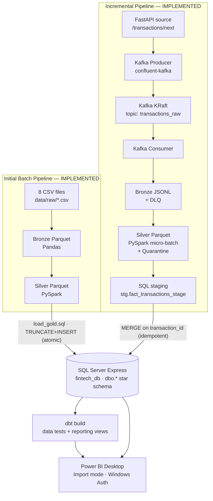
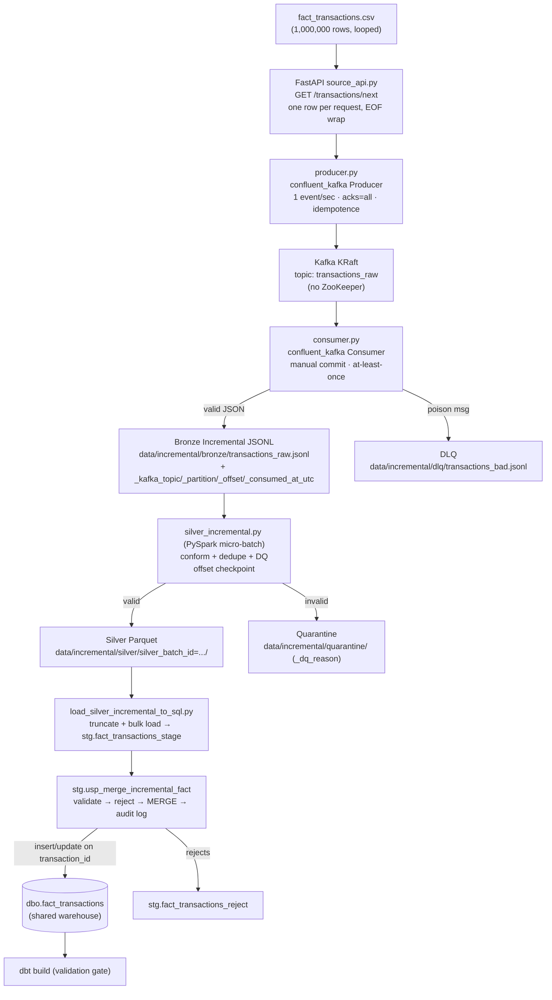
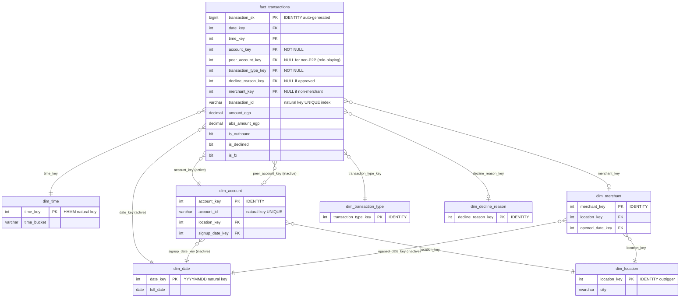
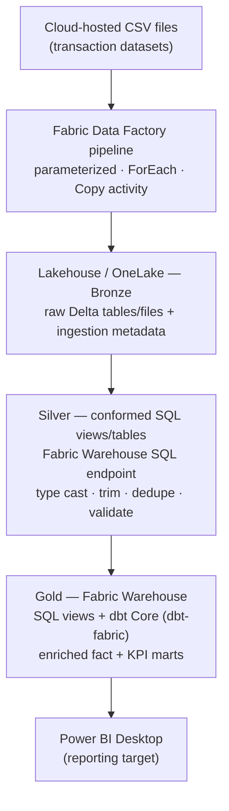
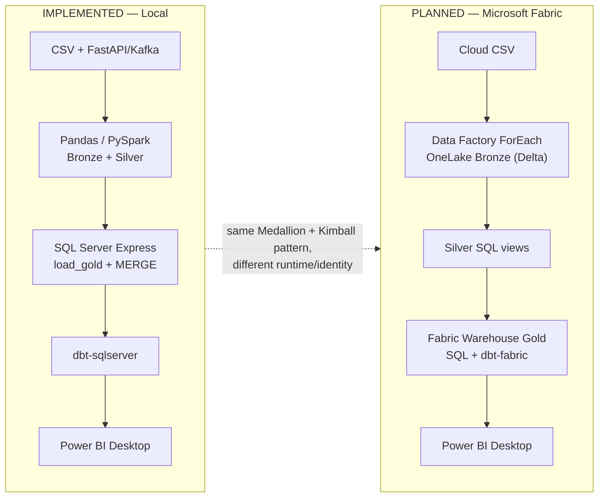

# FinTech Lakehouse — Architecture Document

> **Scope & status legend.** This document covers three things and labels each one explicitly:
> - **[IMPLEMENTED — LOCAL]** Built and verified locally: the initial **batch** pipeline and the **incremental (Kafka)** pipeline, both landing in a local SQL Server Express warehouse, validated by dbt, consumed by Power BI Desktop.
> - **[PLANNED — CLOUD]** A **companion Microsoft Fabric** target architecture, derived from the *Fabric Medallion Cloud Solution Document (v1.1)*. It is a **design/target**, not an implemented system.
>
> Every "[IMPLEMENTED]" statement is verifiable against repository source files. Every "[PLANNED — CLOUD]" statement is sourced from the Fabric document and must **not** be read as already built.

---

## Table of Contents

1. [Executive Summary](#1-executive-summary)
2. [Architecture Scope](#2-architecture-scope)
3. [Business Problem](#3-business-problem)
4. [Local Solution Overview](#4-local-solution-overview)
5. [High-Level Architecture Diagram](#5-high-level-architecture-diagram)
6. [Initial Batch Pipeline Architecture](#6-initial-batch-pipeline-architecture)
7. [Incremental Pipeline Architecture](#7-incremental-pipeline-architecture)
8. [Shared Local Warehouse Architecture](#8-shared-local-warehouse-architecture)
9. [dbt Validation and Reporting Layer](#9-dbt-validation-and-reporting-layer)
10. [Power BI Desktop Consumption](#10-power-bi-desktop-consumption)
11. [Technology Responsibility Matrix](#11-technology-responsibility-matrix)
12. [Medallion Architecture](#12-medallion-architecture)
13. [Kimball Star Schema](#13-kimball-star-schema)
14. [Local Orchestration and Runtime](#14-local-orchestration-and-runtime)
15. [Incremental Reliability Design](#15-incremental-reliability-design)
16. [Data Quality and Validation Strategy](#16-data-quality-and-validation-strategy)
17. [Security and Authentication Model](#17-security-and-authentication-model)
18. [Microsoft Fabric Cloud Target Architecture](#18-microsoft-fabric-cloud-target-architecture)
19. [Local vs Cloud Architecture Comparison](#19-local-vs-cloud-architecture-comparison)
20. [Design Trade-offs](#20-design-trade-offs)
21. [Known Limitations](#21-known-limitations)
22. [Future Evolution](#22-future-evolution)
23. [Appendix: Key Run Commands](#23-appendix-key-run-commands)
24. [Appendix: Evidence / Validation Checklist](#24-appendix-evidence--validation-checklist)

---

## 1. Executive Summary

The **FinTech Lakehouse** is a local, end-to-end analytics platform for digital payment and transfer transactions. It implements the **Medallion Architecture** (Bronze → Silver → Gold) and a **Kimball star schema**, and it supports **two complementary ingestion modes** into the same warehouse:

- **[IMPLEMENTED — LOCAL] Initial batch pipeline** — loads the full historical dataset (8 CSV files, ~1.3M rows) and **initializes** the warehouse (dimensions + fact).
- **[IMPLEMENTED — LOCAL] Incremental pipeline** — an event-driven path that simulates a real banking feed: only **new transactions** stream through FastAPI → Kafka → Bronze JSONL → PySpark Silver → SQL staging → an idempotent **SQL `MERGE`** into the existing fact table.

Both paths converge on a single **SQL Server Express** warehouse (`fintech_db.dbo.*`), which is then **validated and documented by dbt Core** and consumed by **Power BI Desktop**. A separate, **[PLANNED — CLOUD]** companion design re-expresses the same Medallion pattern on **Microsoft Fabric** (Data Factory → OneLake Lakehouse → Warehouse SQL/dbt Gold → Power BI). The cloud design is a target blueprint only; the running system is entirely local.

---

## 2. Architecture Scope

### 2.1 [IMPLEMENTED — LOCAL] Initial Batch Pipeline

```
8 CSV files → Python/Pandas ingestion → Bronze Parquet → PySpark Silver → SQL Server Express → dbt validation/reporting → Power BI Desktop
```
Initializes the warehouse with the full star (7 dimensions + fact). Orchestrated by Airflow (Docker) for the lake stages and PowerShell for the warehouse stages.

### 2.2 [IMPLEMENTED — LOCAL] Incremental Pipeline

```
fact_transactions.csv → FastAPI simulated source → Confluent Kafka Producer → Kafka KRaft topic transactions_raw → Confluent Kafka Consumer → Bronze Incremental JSONL → PySpark Silver Incremental Parquet → Quarantine → SQL Incremental Staging → SQL MERGE into dbo.fact_transactions → dbt validation/reporting → Power BI Desktop
```
Loads **only new transaction events**; dimensions are assumed already present from the batch load.

### 2.3 [PLANNED — CLOUD] Microsoft Fabric Cloud Solution / Target Architecture

```
Cloud CSV source → Microsoft Fabric Data Factory pipeline → Fabric Lakehouse / OneLake Bronze → Silver conformed SQL views/tables → Fabric Warehouse Gold → SQL/dbt Gold models → Power BI Desktop
```
Companion target design from the Fabric document. **Not implemented in this repository.** The document itself notes that the referenced private Fabric pipeline could not be externally inspected (see §18).

---

## 3. Business Problem

A fintech company processes large volumes of digital payment and transfer transactions, but **raw operational data exists as scattered CSV exports**. Without a structured data platform, analysis of transaction volume, decline reasons, FX activity, merchant performance, customer behavior, and operational KPIs is **slow, manual, and error-prone**. There is no trusted, conformed, referentially-correct dataset that business and analytics teams can rely on, and no repeatable way to absorb **new transactions** as they arrive.

**The solution.** The project creates a local **FinTech Lakehouse** that supports both **historical batch loading** and **incremental, event-driven ingestion**, producing a **trusted SQL Server warehouse** (Kimball star schema) that is **validated by dbt** and **consumed by Power BI Desktop**. The batch path establishes the warehouse; the incremental path keeps the fact table current as new transaction events occur — both enforcing the same data-quality and referential-integrity guarantees so every downstream KPI (volume, decline rate, FX mix, merchant performance, customer segments) is reproducible and correct.

---

## 4. Local Solution Overview

The local platform runs across **two execution environments**, a split dictated by a hard technical constraint (detailed in §17): Windows Authentication to SQL Server cannot be used from a Linux container without impractical Kerberos infrastructure.

- **Docker (Linux containers):** Airflow orchestration, Pandas CSV extraction, PySpark silver conformance (batch); a separate Kafka KRaft broker and a Spark container for the incremental Silver job.
- **Windows host:** SQL Server Express warehouse, the SQL incremental loader, dbt validation, and Power BI Desktop — all using Windows (Trusted) Authentication.

The **handoff artifact** between lake and warehouse is **Parquet** (Silver), for both pipelines. The incremental pipeline adds an event backbone (Kafka) and a **staging + MERGE** seam in SQL so that new events are upserted, not full-reloaded.

---

## 5. High-Level Architecture Diagram

**Diagram 1 — Both implemented local flows converging into the local SQL Server warehouse.**



The batch pipeline **initializes** the star; the incremental pipeline **upserts** new transactions into the same `dbo.fact_transactions`. dbt validates the converged result and publishes reporting views.

---

## 6. Initial Batch Pipeline Architecture

**[IMPLEMENTED — LOCAL].** The batch pipeline ingests eight CSV files (~1.3M rows total), transforms them through bronze → silver, loads them into the SQL Server star, and validates with dbt. It is the pipeline that **initializes the warehouse**.

### 6.1 Step-by-step

| Step | Component | Detail |
|---|---|---|
| 1. CSV → Bronze | `ingestion/extract_to_bronze.py` (Pandas) | `read_csv(dtype=str, chunksize=500_000)` — all values as strings; appends lineage `_ingested_at_utc`, `_source_file`; writes `data/lake/bronze/<table>/*.parquet`. Idempotent via `shutil.rmtree` before write. |
| 2. Bronze → Silver | `spark/bronze_to_silver.py` (PySpark, `spark-submit`) | Per-table `SCHEMAS` type casting (`INT/LONG/STRING/DECIMAL(18,2)/DATE`), `trim()` + empty→`NULL`, `dropDuplicates([natural_key])`. Lineage columns dropped. Writes `data/lake/silver/<table>/`. |
| 3. Silver → SQL `[silver].*` | `ingestion/load_silver_to_sqlserver.py` (pyodbc) | Reads Parquet via `pyarrow.dataset` in 50K batches, `fast_executemany` insert into `fintech_db.[silver].*` (transient ODS). Windows Auth. |
| 4. Gold load | `sql/drop_star_constraints.sql` → `load_gold.sql` → `add_star_constraints.sql` (`sqlcmd -E`) | Drops 11 FKs, `XACT_ABORT ON` atomic TRUNCATE+INSERT in FK order (`IDENTITY_INSERT` for surrogate dims; `transaction_sk` auto-generated), re-adds 11 FKs. |
| 5. dbt build | `dbt/fintech` | Source tests + reporting view (see §9). |
| 6. Power BI | Desktop, Import mode | 8 gold tables + reporting view; 11 relationships; DAX measures (see §10). |

Orchestration: **Airflow** (Docker) runs steps 1–2; **`run_gold.ps1`** (PowerShell, Windows host) runs steps 3–5 (see §14). The two are bridged by the Silver Parquet on the shared `./data` volume.

---

## 7. Incremental Pipeline Architecture

**[IMPLEMENTED — LOCAL].** An event-driven path that simulates how a real bank receives continuous transaction events and incrementally loads them into the already-initialized warehouse.

**Flow:**
```
fact_transactions.csv → FastAPI → Producer → Kafka topic transactions_raw → Consumer
→ Bronze JSONL → Silver PySpark → Silver Parquet → SQL staging → SQL MERGE → dbt validation → reporting views
```

**Diagram 2 — Incremental pipeline detailed flow (with reliability seams).**



### 7.1 Design rationale (the "why" behind each choice)

| Decision | Why |
|---|---|
| **Only `fact_transactions.csv` is streamed** | The fact is the only genuinely append-only, high-velocity table — every card swipe / transfer is a new immutable event. Dimensions are context that changes rarely. |
| **Dimensions remain batch-loaded** | They are low-cardinality master/reference data shared across the warehouse. Streaming them adds machinery for no benefit and risks a fact referencing a dimension key that has not landed yet. Standard "dimensions first, facts incrementally." |
| **FastAPI simulates the source system** | Real source systems expose data over an API, not raw files. A `GET /transactions/next` boundary lets the producer pull events over HTTP exactly as from a real REST endpoint — the CSV could later be swapped for a database behind the same URL. |
| **Kafka in KRaft mode (no ZooKeeper)** | KRaft is the modern, single-process Kafka quorum — fewer moving parts, simpler local container, no separate ZooKeeper ensemble to run or fail. |
| **Confluent Kafka Producer/Consumer** | The `confluent-kafka` client (librdkafka) is the production-grade, high-throughput Python client with first-class delivery callbacks, idempotence, and manual offset control. |
| **Bronze Incremental as JSONL** | Newline-delimited JSON is append-friendly, human-readable, schema-flexible for raw events, and trivially consumable by Spark. It preserves the raw event exactly (Medallion Bronze principle). |
| **Kafka metadata stored** (`_kafka_topic`, `_kafka_partition`, `_kafka_offset`, `_consumed_at_utc`) | Full lineage back to the exact Kafka message, and — crucially — the **offset is the natural watermark** that drives idempotent incremental Silver processing. Mirrors the batch Bronze `_ingested_at_utc`/`_source_file` convention. |
| **DLQ for poison messages** | A message that cannot be parsed must not crash the consumer or be silently lost. It is routed to a Dead Letter Queue with the raw bytes + error, keeping the pipeline flowing and the bad data auditable. |
| **Silver Incremental uses PySpark micro-batch** | Reuses the exact batch Silver conforming logic (type casts, trim, `''→NULL`, dedupe on `transaction_id`) on streamed rows, in bounded micro-batches — no Structured Streaming complexity, runs on demand or via a scheduler. |
| **Checkpoint uses Kafka offsets** | Offsets are monotonic and unique per partition — an exact, replay-safe watermark (better than row counts or wall-clock timestamps). Stored in `data/incremental/_checkpoints/silver_offsets.json`. |
| **Quarantine exists** | Invalid rows are isolated with a `_dq_reason` rather than dropped — bad data stays auditable and replayable (financial systems must never silently lose a transaction). |
| **SQL staging is mandatory** | It lets the load **validate and quarantine** (dedupe, null keys, FK existence, null measures) *before* touching the warehouse or aborting a MERGE on an FK violation, and enables a fast, server-side, atomic set-based MERGE. |
| **SQL `MERGE` is used** | An idempotent upsert keyed on the business key `transaction_id`: insert new transactions, conditionally update existing ones, never duplicate — the core of incremental loading. |
| **dbt validates instead of replacing the MERGE** | dbt is the post-load quality gate and documentation/reporting layer; it asserts the warehouse is still correct after each MERGE. It does not load or merge data — separation of concerns. |

Component files: [`incremental/api/source_api.py`](../incremental/api/source_api.py), [`producer.py`](../incremental/producer.py), [`consumer.py`](../incremental/consumer.py), [`silver_incremental.py`](../incremental/silver_incremental.py), [`sql/create_incremental_staging.sql`](../incremental/sql/create_incremental_staging.sql), [`sql/merge_incremental_fact.sql`](../incremental/sql/merge_incremental_fact.sql), [`load_silver_incremental_to_sql.py`](../incremental/load_silver_incremental_to_sql.py).

---

## 8. Shared Local Warehouse Architecture

Both pipelines write to **one** warehouse: `fintech_db` on `ahmed\SQLEXPRESS`, schema `dbo` (the Kimball star). They differ only in **how** they write the fact:

| Aspect | Batch (initialize) | Incremental (keep current) |
|---|---|---|
| Fact write pattern | `TRUNCATE` + `INSERT … SELECT` (full reload) | `MERGE` on `transaction_id` (upsert delta) |
| Atomicity | `XACT_ABORT ON` single transaction | `XACT_ABORT ON` single transaction per batch |
| Dimensions | Loaded/refreshed | Assumed already present (validated as FKs) |
| Surrogate `transaction_sk` | IDENTITY auto-generated | IDENTITY auto-generated on insert |
| Staging | `[silver].*` ODS tables | `stg.fact_transactions_stage` (+ `stg.fact_transactions_reject`, `stg.incremental_load_log`) |

The incremental loader **never deletes** warehouse rows and never re-loads history; it only inserts new `transaction_id`s and conditionally updates existing ones. The fact's `UNIQUE` index on `transaction_id` (`UX_fact_transactions_natural_key`) is the shared idempotency anchor for both pipelines and for dbt's uniqueness test.

---

## 9. dbt Validation and Reporting Layer

**[IMPLEMENTED — LOCAL].** dbt Core (`dbt-core` 1.8.x + `dbt-sqlserver`) sits **on top** of the gold star as the validation, documentation, and reporting layer. It **reads** `dbo.*` as **sources** and **writes** only reporting **views** (schema `[reporting]`). It does not load data or duplicate the SQL MERGE.

### 9.1 Tests (current state)

`dbt build` → **PASS=47** (45 data tests + 2 reporting views), WARN=0, ERROR=0.

| Category | Source / definition | Covers |
|---|---|---|
| `unique`, `not_null` | `models/_sources.yml` | All dimension PKs/natural keys + `fact_transactions.transaction_id` (unique + not null) |
| `relationships` (no orphan FKs) | `models/_sources.yml` | All 7 fact→dimension FK paths |
| `accepted_values` | `models/_sources.yml` | `is_outbound`/`is_declined`/`is_fx` ∈ {0,1}; `time_bucket`, `customer_tier`, `account_status`, `merchant_size` domains |
| **Singular sanity tests** | `tests/*.sql` | `assert_fact_transactions_not_empty` (row-count sanity after load), `assert_abs_amount_egp_nonnegative`, `assert_abs_amount_egp_matches_amount`, `assert_declined_have_decline_reason` (severity `warn`) |

### 9.2 Reporting views (`[reporting]` schema)

- `rpt_warehouse_health` — one-row post-load health/reconciliation snapshot (total vs distinct transactions, declined/fx/outbound counts, date span, gross volume). `total_transactions == distinct_transaction_ids` is the at-a-glance "no duplicate facts" check after each incremental MERGE.
- `rpt_daily_transactions` — daily summary (counts, gross & average ticket) for Power BI.

A **green `dbt build` after a MERGE** is the final quality gate confirming the warehouse remains correct (unique keys, intact FKs, valid domains, sane measures) before Power BI refresh. See [`dbt/fintech/README_DBT_VALIDATION.md`](../dbt/fintech/README_DBT_VALIDATION.md).

---

## 10. Power BI Desktop Consumption

Power BI Desktop connects to `ahmed\SQLEXPRESS` / `fintech_db` in **Import mode** via **Windows Authentication**. The analyst imports the gold tables (and optionally the `[reporting]` views), configures **11 relationships** (including the role-playing `peer_account_key` and inactive signup/opened date links), and builds DAX measures. Reporting remains **Power BI Desktop** for both the local project and the cloud target document (no Power BI Service in scope). Deterministic benchmark values (frozen source) make a stale/mis-connected model easy to detect (see §16.5).

---

## 11. Technology Responsibility Matrix

| Component | Runtime | Pipeline | Owns | Does NOT own |
|---|---|---|---|---|
| **Apache Airflow** 2.9.3 | Docker | Batch | DAG scheduling; bronze extraction + Spark submit triggers | SQL Server load; dbt; incremental |
| **Pandas** 2.2.2 | Docker | Batch | CSV ingestion (500K chunks); lineage columns | Transformations |
| **PySpark** 3.5.x | Docker | Batch + Incremental | Type casting, dedupe, conformance (batch & incremental Silver) | I/O outside the lake; SQL load |
| **FastAPI / uvicorn** | Host venv | Incremental | Simulated source `GET /transactions/next` | Kafka; persistence |
| **confluent-kafka** | Host venv | Incremental | Producer + Consumer (delivery callbacks, manual commit) | Transformation |
| **Apache Kafka (KRaft)** 7.8.3 | Docker | Incremental | Durable event backbone; topic `transactions_raw` | Business logic |
| **PyArrow** | Docker + Host | Both | Parquet writes/reads | Type casting |
| **SQL Server Express** | Windows host | Both | Warehouse storage; FK enforcement; IDENTITY `transaction_sk`; MERGE; staging | ETL; orchestration |
| **pyodbc** 5.x | Windows host | Both | ODBC connection; `fast_executemany`; staging load + proc call | Transformation |
| **sqlcmd** | Windows host | Batch | `setup_warehouse.sql`, FK drop/add, `load_gold.sql` | Python execution |
| **dbt-core** 1.8.x | Windows host | Both | Data-quality tests; reporting views; docs | Data loading; DDL |
| **dbt-sqlserver** 1.8.4 | Windows host | Both | SQL Server adapter | Non-testing/non-view work |
| **dbt-fabric** 1.8.7 (pinned, unused) | Host | — | Future Fabric migration target | Nothing in the current pipeline |
| **Power BI Desktop** | Windows host | Both | Import semantic model; DAX; dashboards | Transformation |
| **PostgreSQL** 15 | Docker | Batch | Airflow metadata DB only | Project/warehouse data |
| **PowerShell** 5.1+ | Windows host | Both | `run_gold.ps1`, `run_all.ps1`; incremental run commands | Docker beyond `docker compose` |

---

## 12. Medallion Architecture

Both pipelines follow Bronze → Silver → Gold, with increasing strictness:

| Layer | Batch artifact | Incremental artifact | Principle |
|---|---|---|---|
| **Bronze** | `data/lake/bronze/<table>/*.parquet` (strings + `_ingested_at_utc`, `_source_file`) | `data/incremental/bronze/transactions_raw.jsonl` (raw event + `_kafka_*`, `_consumed_at_utc`) + DLQ | Faithful raw landing; **append-only**; no validation |
| **Silver** | `data/lake/silver/<table>/` (typed, trimmed, deduped) | `data/incremental/silver/silver_batch_id=…/` + **quarantine** + offset **checkpoint** | Conform to warehouse types; dedupe on natural key; quarantine invalid |
| **Gold** | `dbo.*` star (full reload) | `dbo.fact_transactions` (MERGE upsert) + `stg.*` staging/reject/audit | Kimball star; FK-enforced; idempotent; dbt-validated |

Bronze is deliberately **not validated** — schema/DQ enforcement happens at Silver (Spark casts) and again at the SQL staging/MERGE boundary; bad data fails loudly or is quarantined, never silently stored.

---

## 13. Kimball Star Schema

**[IMPLEMENTED — LOCAL].** 7 dimensions + `fact_transactions`, defined in `sql/01_create_star.sql`.



**Key modeling points:** `dim_date`/`dim_time` use stable natural keys (no IDENTITY); the other dimensions use IDENTITY surrogate keys passed through with `IDENTITY_INSERT` during the batch load. `dim_account` is a **role-playing** dimension (active `account_key`, inactive `peer_account_key`). `dim_location` and `dim_date` act as **outriggers**. `fact_transactions` carries a `UNIQUE` index on `transaction_id` (the business key used by both the batch dedupe and the incremental MERGE) and five purpose-built indexes including two **filtered** indexes for decline/FX subsets. (Full column-level detail and index list retained from prior revisions in `sql/01_create_star.sql`.)

---

## 14. Local Orchestration and Runtime

### 14.1 Batch orchestration
- **`run_all.ps1`** — full rebuild: `docker compose up`, runs `extract_to_bronze.py` + `bronze_to_silver.py` directly inside the Airflow scheduler container, then calls `run_gold.ps1`.
- **`run_gold.ps1`** — gold runner (Windows host): silver→SQL load, FK-drop → `load_gold.sql` → FK-add, then `dbt build`. Uses `$ErrorActionPreference="Stop"` + `Invoke-Sql` exit-code checks for fail-fast atomicity.
- **Airflow DAG `fintech_lakehouse`** — `extract_csv_to_bronze` → `spark_bronze_to_silver` → `gold_handoff` (a marker task; Airflow cannot invoke host PowerShell/Windows-Auth SQL). Boundary: **Airflow owns the lake; PowerShell owns the warehouse.**

### 14.2 Incremental orchestration & runtime
Run manually (or later by a scheduler) as discrete stages:
- **Kafka** — `incremental/docker-compose.yml` (KRaft, project `fintech_kafka`), topic `transactions_raw` created with `--if-not-exists`.
- **Source + Producer + Consumer** — host Python **3.11** venv (`.venv-incremental`); `confluent-kafka` requires Python **3.11/3.12** (no wheels for 3.13/3.14).
- **Silver Incremental (PySpark)** — **runs in a Spark container** (`apache/spark:3.5.1`, `spark-submit`) because the host has **no JDK**; PySpark is a JVM engine. This is the supported path on this machine (host `python silver_incremental.py` fails with `ModuleNotFoundError`/no-Java).
- **SQL load + MERGE** — host `python load_silver_incremental_to_sql.py` (pyodbc, Windows Auth); applies the staging DDL + proc and processes only new `silver_batch_id` batches.
- **dbt** — `dbt build` on the host.

---

## 15. Incremental Reliability Design

**[IMPLEMENTED — LOCAL].** Reliability is layered end-to-end:

| Mechanism | Where | Guarantee |
|---|---|---|
| **At-least-once consumer write** | `consumer.py` | Manual commit, `enable.auto.commit=False` — no event acknowledged before it is durably stored |
| **Write before Kafka offset commit** | `consumer.py` | Bronze line is `flush`+`fsync`-ed, **then** the offset is committed — a crash mid-write replays, never loses |
| **DLQ for poison messages** | `consumer.py` → `dlq/transactions_bad.jsonl` | Unparseable messages are isolated with raw bytes + error; consumer keeps running |
| **Bronze append-only** | JSONL landing | Immutable raw history; never mutated in place |
| **Silver checkpoint file** | `_checkpoints/silver_offsets.json` | Per-partition high-water offset → process only new Bronze rows |
| **Silver idempotency** | `silver_incremental.py` | Deterministic `silver_batch_id` from offset range + dynamic partition overwrite → re-runs never duplicate |
| **Quarantine with `_dq_reason`** | `quarantine/` | Invalid rows isolated, not dropped (auditable, replayable) |
| **Non-underscore `silver_batch_id` partition** | Silver output | Partition folder `silver_batch_id=…` (not `_`-prefixed) so pandas/pyarrow/Spark readers don't treat it as hidden and skip it |
| **SQL staging table** | `stg.fact_transactions_stage` | Validate/quarantine before the warehouse; transient (truncated per run) |
| **SQL transaction + `XACT_ABORT ON`** | `stg.usp_merge_incremental_fact` | All-or-nothing per batch; any error rolls back; `FAILED` recorded after rollback |
| **SQL audit / load log** | `stg.incremental_load_log` | One row per (batch, attempt); filtered `UNIQUE` index makes a second SUCCESS impossible |
| **Idempotent `MERGE` on `transaction_id`** | merge proc | Insert new, conditionally update changed, no-op identical replays |
| **No accidental deletes** | merge proc | Deliberately **no** `WHEN NOT MATCHED BY SOURCE` — warehouse rows absent from a batch are never deleted |
| **dbt build as final gate** | `dbt/fintech` | Post-MERGE validation of uniqueness, FKs, domains, and sanity |

**Two-layer idempotency:** batch-level (a `SUCCESS` batch is skipped) **and** row-level (MERGE on `transaction_id`). A forced reprocess inserts/updates nothing extra.

---

## 16. Data Quality and Validation Strategy

Quality is enforced progressively across both pipelines:

1. **Bronze — none (intentional).** Strings preserved exactly (batch `dtype=str`; incremental raw JSON). Failures surface downstream, not via silent coercion. Poison Kafka messages → DLQ.
2. **Silver — conform + DQ.** Spark casts (bad value → `NULL`), `trim()`/`''→NULL`, dedupe on `transaction_id`. Incremental Silver additionally **quarantines** rows failing DQ with a `_dq_reason`; counts reconcile (`valid + quarantined == input`).
3. **SQL DDL constraints.** `NOT NULL`, `UNIQUE` (incl. `transaction_id`), 11 FKs.
4. **SQL staging validation (incremental).** Before MERGE, the proc rejects (to `stg.fact_transactions_reject`) duplicates, null keys, null measures, and **FK-not-found** rows — so a single bad row can't abort the MERGE. Audit counts in `stg.incremental_load_log`; the data-loss invariant is `rows_valid + rows_rejected == rows_staged`.
5. **dbt tests (final gate).** 45 data tests (uniqueness, not-null, relationships/orphan-FK, accepted values, plus row-count/measure sanity) — see §9.
6. **Power BI benchmark check.** Frozen-source deterministic values (e.g., Transaction Count **1,000,000**, Gross Volume ≈ **689,181,271 EGP**, Declined **42,478** / 4.25%, FX **43,783**) make stale/mis-connected models obvious.

---

## 17. Security and Authentication Model

**[IMPLEMENTED — LOCAL].**

- **Windows (Trusted) Authentication everywhere for SQL Server** — `Trusted_Connection=yes` (pyodbc), `sqlcmd -E`, `windows_login: true` (dbt). **No SQL logins, no passwords, no secrets at rest** for the warehouse. `WH_USER`/`WH_PASSWORD` exist as an unused code path; `.env.example` says *"this project is Windows-auth only."*
- **The hybrid boundary is a security feature, not just a constraint:** Windows Auth (NTLM) cannot be performed from a Linux container without Kerberos/keytab/domain-controller infrastructure that is impractical locally. Hence SQL Server, the SQL loaders, dbt, and Power BI run **on the Windows host**; lake workloads run in Docker.
- **Kafka (local):** `PLAINTEXT://localhost:9092`, single-node KRaft, named volume `kafka_kraft`, project `fintech_kafka` — local development only; no external exposure, no auth (appropriate for a local broker, called out as a limitation in §21).
- **Repository is secret-free:** `.env` and `~/.dbt/profiles.yml` are gitignored; only `*.example` files are committed. Airflow `admin/admin` is local-only.

> **[PLANNED — CLOUD]** identity is entirely different (Microsoft Entra ID, workspace roles, service principals) — see §18; do not conflate it with the local Windows-Auth model.

---

## 18. Microsoft Fabric Cloud Target Architecture

> **[PLANNED — CLOUD] — Companion / target design only.** This section summarizes the *Fabric Medallion Cloud Solution Document (v1.1, "Updated SQL/dbt Gold Warehouse approach")*. It describes a **target** Microsoft Fabric architecture and is **not implemented in this repository**.
>
> **Inspection caveat (from the document):** the supplied Fabric pipeline URL points to a **private Fabric workspace item**; a public request returned only the Microsoft Fabric **sign-in screen**, so **exact pipeline activity names, linked-service details, run history, SQL view definitions, and dbt model definitions were not externally inspectable**. The cloud design is therefore based on the known solution context and should be finalized with screenshots / an exported pipeline definition for exact evidence.

### 18.1 Target flow

**Diagram 3 — Microsoft Fabric cloud target flow (planned).**



### 18.2 Target components (as documented)

| Area | Fabric target (planned) |
|---|---|
| **Ingestion & orchestration** | **Fabric Data Factory pipeline** — parameterized (`sourceFolder`, `fileName`, `targetLayer`, `targetTable`, `loadBatchId`, `runDate`), **ForEach** over a file list, **Copy** activity per file, then SQL/dbt activities. Optional advanced orchestration via Workflow Orchestration Manager / Fabric **Apache Airflow** jobs. |
| **Storage** | **Fabric Lakehouse / OneLake**, **Delta Lake / Delta Parquet** tables across layers. |
| **Bronze** | Raw landing in the Lakehouse with ingestion metadata (`_source_file`, `_load_timestamp`, `_pipeline_run_id`). |
| **Silver** | **Conformed SQL views/tables** in the Fabric **Warehouse / SQL endpoint** (type casting, trimming, dedupe by `transaction_id`, validation) — note: **SQL-view-based**, not PySpark. |
| **Gold** | **Fabric Warehouse** business marts via **SQL queries/views + dbt Core with the `dbt-fabric` adapter** (tested, documented, lineage-tracked). Recommended Gold outputs: `gold_fact_transactions_enriched`, `gold_daily_kpi`, `gold_monthly_kpi`, `gold_transaction_type_kpi`, `gold_customer_segment_kpi`, `gold_merchant_performance`, `gold_decline_analysis`, `gold_fx_analysis`. |
| **Reporting** | **Power BI Desktop** (Service publishing explicitly out of scope in the document). |
| **Identity & governance** | **Microsoft Entra ID** identities; least-privilege **workspace roles**; **service principals** for automation; secrets kept out of code (Key Vault patterns); **GitHub + Fabric Git** for source control. |
| **Operations** | Fabric pipeline **monitoring**/run history; **retries** for transient failures (not for schema/DQ errors); **capacity** management (reduce concurrency, optimize models, avoid full refreshes, scale SKU); deterministic batch IDs to avoid duplicate Gold records. |
| **CI/CD (future maturity)** | GitHub + Fabric Git integration; dev/test/prod workspaces or deployment pipelines. |

The document explicitly mirrors the **local** Gold approach (SQL + dbt) as a deliberate design alignment, and treats CI/CD, enterprise orchestration, and monitoring as a **future maturity path**.

---

## 19. Local vs Cloud Architecture Comparison

> Left column = **[IMPLEMENTED — LOCAL]**; right column = **[PLANNED — CLOUD]** (Fabric document).

| Area | Local implementation | Fabric cloud target |
|---|---|---|
| **Source** | 8 CSV files in `data/raw/` (incl. `dim_location`); fact replayed via FastAPI for the stream | Cloud-hosted CSV files (document lists 7 datasets; extra attributes modeled in dims) |
| **Orchestration** | Airflow (Docker) + PowerShell (`run_gold.ps1`); incremental run scripts | Fabric Data Factory pipeline (ForEach), optionally Fabric Airflow |
| **Bronze** | Parquet (batch) / JSONL (incremental) on local disk | Lakehouse / OneLake Delta tables |
| **Silver** | PySpark conformance to Parquet (+ quarantine, checkpoint) | Conformed **SQL views/tables** in Fabric Warehouse |
| **Gold** | `dbo.*` star: batch full-reload + incremental `MERGE` | Fabric Warehouse SQL views + dbt models (KPI marts) |
| **Warehouse** | SQL Server Express (`fintech_db`) | Fabric Warehouse |
| **dbt** | `dbt-sqlserver` (tests + reporting views) | `dbt-fabric` (Gold models, tests, docs) |
| **Reporting** | Power BI Desktop (Import, Windows Auth) | Power BI Desktop |
| **Authentication** | Windows (Trusted) Auth; no secrets | Microsoft Entra ID; workspace roles; service principals |
| **Monitoring** | PowerShell exit codes; dbt build result; `stg.incremental_load_log` | Fabric monitoring + pipeline run history |
| **Runtime** | Local Docker + Windows host (hybrid) | Fabric capacity (SaaS) |
| **Cost / operational scope** | Free/local; single developer | Fabric capacity (SKU) cost; tenant/workspace governance |

**Diagram 4 — Local (implemented) vs Cloud (planned) at a glance.**



---

## 20. Design Trade-offs

- **Full refresh (batch) vs incremental MERGE.** Batch uses `TRUNCATE`+`INSERT` (simple, perfectly idempotent) to **initialize**; the **incremental** pipeline adds the `MERGE` path to absorb deltas without reloading history. Both coexist on the same fact.
- **Local PySpark vs alternatives.** PySpark in local mode gives scalability headroom and identical code to a cluster; the same conforming logic is reused by batch and incremental Silver.
- **Hybrid execution vs pure Docker.** Hybrid is required for Windows-Auth SQL Server; the trade-off is Windows-only host for the warehouse layer.
- **Kafka KRaft vs ZooKeeper.** KRaft removes a whole subsystem for a single-node local broker.
- **Staging + MERGE vs direct load.** Staging enables pre-MERGE validation/quarantine and a fast, atomic, set-based upsert — worth the extra table.
- **Conditional MERGE update vs insert-only.** Existing `transaction_id`s are updated only when a value actually differs (identical replays are no-ops), balancing idempotency with support for late corrections. (A strict ledger might prefer insert-only + reversal entries — noted as an option.)
- **dbt validates, does not transform the fact.** Keeps loading (SQL) and validation/reporting (dbt) cleanly separated.
- **Windows Auth vs SQL Auth.** Zero-credential, more secure for a single-user local machine.

---

## 21. Known Limitations

- **Windows-only host** for the warehouse/dbt/Power BI layers (Windows-Auth dependency).
- **No JDK on the host** → Silver (batch & incremental) must run via Spark in Docker; host `python silver_incremental.py` fails (`ModuleNotFoundError: pyspark` / no Java).
- **`confluent-kafka` needs Python 3.11/3.12** (no wheels for 3.13/3.14); the venv must be created with `py -3.11`.
- **Local Kafka is single-node, PLAINTEXT, no auth** — development-grade durability/security only (RF=1, one partition).
- **FastAPI source is a simulation** that loops the CSV; at the API→producer hop it is effectively at-most-once (a fetched-but-unpublished row is lost) — acceptable for a simulated source, not a real ledger.
- **Incremental against an already-full `fintech_db`** yields mostly MERGE no-ops (the CSV replays existing `transaction_id`s) — inserts are best demonstrated against a fact that does not already hold those ids.
- **[PLANNED — CLOUD] Fabric internals not verified** — the private pipeline could not be inspected; activity names, linked services, run history, and exact SQL/dbt definitions are unconfirmed.

---

## 22. Future Evolution

- **Scheduler for the incremental pipeline** (Airflow/cron) to run the consumer + Silver + MERGE on a cadence.
- **SCD Type 2** for `dim_account.customer_tier`/`age_band`, `dim_merchant.merchant_size`.
- **dbt incremental models** (`materialized='incremental'`, `unique_key='transaction_id'`) for Gold marts on top of the warehouse fact.
- **Fabric migration** (the prepared path): swap dbt `type: sqlserver → fabric`; replace local loaders with Data Factory Copy/`COPY INTO`; lift the SQL star + dbt models largely unchanged.
- **CI/CD** (GitHub + Fabric Git), monitoring, and capacity governance per the cloud document's maturity path.
- **Load-audit reporting view** over `stg.incremental_load_log` (documented but intentionally not in the default dbt build, to avoid a hard `stg` dependency).

---

## 23. Appendix: Key Run Commands

**Batch (full local rebuild):**
```powershell
cd "f:\NTI FOLDER\NTI INCREMENTAL\fintech-lakehouse"
.\run_all.ps1            # docker up + bronze + silver + run_gold.ps1
# or gold-only (silver Parquet already present):
.\run_gold.ps1
```

**Incremental (4 stages):**
```powershell
# 1) Kafka (KRaft)
cd incremental ; docker compose up -d
docker exec kafka kafka-topics --bootstrap-server localhost:9092 `
  --create --if-not-exists --topic transactions_raw --partitions 1 --replication-factor 1
# 2) source + consumer + producer (Python 3.11 venv; separate terminals)
.\.venv-incremental\Scripts\python.exe -m uvicorn api.source_api:app --port 8000   # from incremental\api use source_api:app
.\.venv-incremental\Scripts\python.exe consumer.py
.\.venv-incremental\Scripts\python.exe producer.py
# 3) Silver Incremental via Dockerized Spark (no host JDK)
cd "f:\NTI FOLDER\NTI INCREMENTAL\fintech-lakehouse"
docker run --rm -v "${PWD}\data:/data" -v "${PWD}\incremental:/app" `
  -e BRONZE_JSONL=/data/incremental/bronze/transactions_raw.jsonl `
  -e SILVER_DIR=/data/incremental/silver -e QUARANTINE_DIR=/data/incremental/quarantine `
  -e CHECKPOINT_FILE=/data/incremental/_checkpoints/silver_offsets.json `
  apache/spark:3.5.1 /opt/spark/bin/spark-submit /app/silver_incremental.py
# 4) SQL staging + MERGE, then dbt validation
$env:WH_DATABASE="fintech_db" ; python incremental\load_silver_incremental_to_sql.py
cd dbt\fintech ; dbt build
```

**dbt validation / docs:**
```powershell
cd "f:\NTI FOLDER\NTI INCREMENTAL\fintech-lakehouse\dbt\fintech"
dbt debug ; dbt build ; dbt docs generate
```

---

## 24. Appendix: Evidence / Validation Checklist

**[IMPLEMENTED — LOCAL] — verified:**
- [x] Batch: bronze (Pandas) → silver (PySpark) → `[silver].*` → atomic gold load → dbt → Power BI.
- [x] Incremental Bronze: producer→Kafka→consumer appends JSONL with `_kafka_topic/_partition/_offset/_consumed_at_utc`; poison message routed to DLQ; consumer commits only after durable write.
- [x] Incremental Silver: offset checkpoint; quarantine with `_dq_reason`; idempotent re-run = 0 new; partition folder `silver_batch_id=…` readable by pandas/pyarrow.
- [x] SQL incremental: staging + reject + `incremental_load_log`; `XACT_ABORT` rollback verified (forced failure → fact unchanged, FAILED logged, exit 1); idempotent rerun skips SUCCESS batch; conditional MERGE update (1 changed row → 1 update, others untouched); `rows_valid + rows_rejected == rows_staged`; no orphan FKs; `COUNT(*) == COUNT(DISTINCT transaction_id)`.
- [x] dbt: `dbt debug` OK; `dbt build` PASS=47 (45 data tests + 2 reporting views), WARN=0, ERROR=0; `dbt docs generate` writes `manifest.json`/`catalog.json`/`index.html`.
- [x] Reporting reconciliation: `rpt_warehouse_health` shows `total_transactions == distinct_transaction_ids` (1,000,000).

**[PLANNED — CLOUD] — NOT verified (evidence required):**
- [ ] Fabric pipeline canvas / activity names / parameters (private workspace — not inspectable).
- [ ] Lakehouse/Warehouse item names, SQL view + dbt-fabric model definitions, run history.
- [ ] Entra ID roles / service principal configuration; capacity/SKU; CI/CD wiring.

---

*Architecture version: 2.0 (local batch + local incremental implemented; Microsoft Fabric cloud target planned) | Last verified: 2026-06-30*
*Local statements verified against repository source (Dockerfiles, `docker-compose.yml`(s), `extract_to_bronze.py`, `bronze_to_silver.py`, `load_silver_to_sqlserver.py`, `sql/*.sql`, `incremental/*` producer/consumer/api/silver/sql/loader, `dbt/fintech/*`, `run_*.ps1`). Cloud statements sourced from the Fabric Medallion Cloud Solution Document (v1.1), whose referenced private Fabric pipeline was not externally inspectable.*
