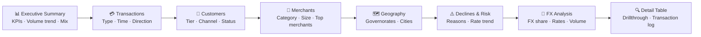
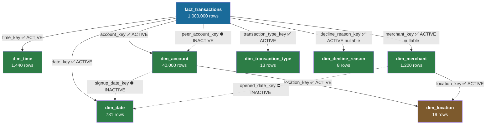
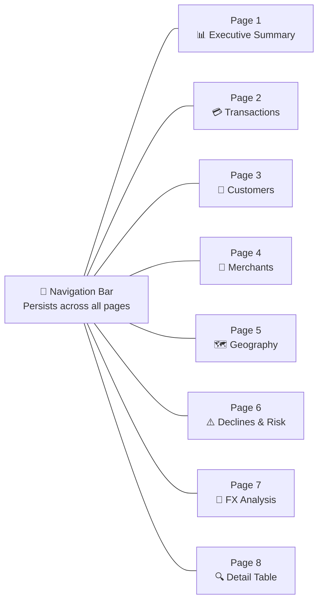

# FinTech Lakehouse — Power BI Implementation Guide

> **Quick reference:** [`docs/POWER_BI.md`](POWER_BI.md) is the connection checklist and benchmark table.  
> This guide teaches the full Power BI implementation from first principles using this warehouse as the working example.

---

## Table of Contents

1. [Overview](#1-overview)
2. [Connecting Power BI Desktop](#2-connecting-power-bi-desktop)
3. [Model Validation](#3-model-validation)
4. [Model Cleanup](#4-model-cleanup)
5. [Recommended DAX Measures](#5-recommended-dax-measures)
6. [DAX Fundamentals](#6-dax-fundamentals)
7. [Dashboard Design](#7-dashboard-design)
8. [Report Pages](#8-report-pages)
9. [UX Best Practices](#9-ux-best-practices)
10. [Performance Optimization](#10-performance-optimization)
11. [Deployment](#11-deployment)
12. [Troubleshooting](#12-troubleshooting)
13. [Interview Questions](#13-interview-questions)
14. [Pre-Publication Checklist](#14-pre-publication-checklist)

---

## 1. Overview

### 1.1 What This Power BI Solution Is

This Power BI solution is the analytical front-end of the FinTech Lakehouse pipeline. It connects directly to the validated Kimball star schema in `fintech_db` on SQL Server and delivers executive and operational dashboards covering payment volumes, customer behaviour, merchant performance, geographic distribution, decline analysis, and foreign exchange activity.

The solution is built in **Import mode** — all data is loaded into Power BI's in-memory VertiPaq engine at refresh time, enabling sub-second query response on 1,000,000 transactions.

### 1.2 Business Objective

The dashboard answers the following business questions from a fintech portfolio:

| Domain | Business Questions |
|---|---|
| **Volume & Revenue** | What is total gross transaction volume? What is the average ticket size? How is volume trending month over month? |
| **Customers** | Which customer tiers generate the most volume? Which acquisition channels are most productive? Which accounts are inactive? |
| **Merchants** | Which merchant categories drive the most transactions? Which individual merchants have the highest volume? |
| **Geography** | Which governorates and cities are the most active? Is there geographic concentration risk? |
| **Risk & Declines** | What is the decline rate? Which decline reasons dominate? Which transaction types decline most often? |
| **FX** | What proportion of transactions are foreign exchange? What is the average exchange rate? |
| **P2P** | How much volume is peer-to-peer? Who are the most active P2P participants? |

### 1.3 Dataset Overview

The warehouse contains 8 tables loaded fresh on each pipeline run:

| Table | Schema | Rows | Purpose |
|---|---|---|---|
| `fact_transactions` | `dbo` | 1,000,000 | One row per financial transaction — the grain |
| `dim_account` | `dbo` | 40,000 | Customer / account attributes |
| `dim_merchant` | `dbo` | 1,200 | Merchant attributes |
| `dim_date` | `dbo` | 731 | Calendar dates 2023-01-01 → 2024-12-31 |
| `dim_time` | `dbo` | 1,440 | One row per minute of the day (HHMM) |
| `dim_location` | `dbo` | 19 | Cities and governorates (shared outrigger) |
| `dim_transaction_type` | `dbo` | 13 | Transaction type and group |
| `dim_decline_reason` | `dbo` | 8 | Decline reason lookup |
| `rpt_daily_transactions` | `reporting` | 731 | Optional pre-aggregated daily summary (dbt view) |

### 1.4 Why a Kimball Star Schema Is Ideal for Power BI

A star schema is the optimal structure for Power BI because:

1. **VertiPaq alignment.** Power BI's in-memory engine (VertiPaq) stores data column by column with compression. The star schema's wide, denormalized dimension tables compress extremely well — small cardinality columns (`customer_tier`, `account_status`, `merchant_category`) achieve near-lossless compression.

2. **Direct relationship mapping.** Power BI's relationship engine is designed exactly for one-to-many (dimension→fact) joins. Each relationship maps to a single key column on both sides — no ambiguity, no bridging tables needed.

3. **Filter propagation.** DAX filter context propagates automatically from dimension tables to the fact table through active relationships. Slicers on `dim_date[year]` or `dim_merchant[merchant_category]` automatically restrict `fact_transactions` rows — no JOIN syntax required.

4. **No many-to-many.** A properly built star schema has only many-to-one (fact-to-dim) cardinality. Many-to-many relationships hurt performance and complicate DAX — this model avoids them entirely.

5. **Predictable DAX.** Measures written against a star schema behave consistently. Analysts learn one mental model and apply it across all measures.

### 1.5 Expected Final Dashboard

Eight report pages cover the full analytical scope:



---

## 2. Connecting Power BI Desktop

### 2.1 Prerequisites

Before opening Power BI Desktop, confirm the pipeline has completed successfully:

```
✅ run_all.ps1 (or run_gold.ps1) completed with exit 0
✅ dbt build returned 39/39 nodes passing
✅ SQL Server Express is running (ahmed\SQLEXPRESS)
✅ fintech_db exists and contains 8 gold tables in dbo schema
```

If the pipeline has not run, see `DEPLOYMENT.md` for setup instructions.

### 2.2 Install Power BI Desktop

Download Power BI Desktop from [https://powerbi.microsoft.com/desktop](https://powerbi.microsoft.com/desktop) (free download, Windows only). Install with default settings. No licence required for local development — a Microsoft 365 account is required only for publishing to the Power BI Service.

### 2.3 Connect to SQL Server

1. Open Power BI Desktop → **Home** ribbon → **Get data** → **SQL Server**.

2. Fill in the connection dialog:

   | Field | Value |
   |---|---|
   | **Server** | `ahmed\SQLEXPRESS` |
   | **Database** | `fintech_db` |
   | **Data Connectivity mode** | **Import** |

   Leave **SQL statement** empty — you will select tables from the Navigator.

3. Click **OK**. An authentication dialog appears.

4. Select **Windows** authentication (left panel). Leave the credentials blank — Power BI uses the currently logged-in Windows user, which is the same identity SQL Server trusts via NTLM.

5. Click **Connect**.

### 2.4 Import vs DirectQuery — Why Import Mode

| Property | Import (recommended) | DirectQuery |
|---|---|---|
| **Query speed** | Sub-second — data is in RAM | Depends on SQL Server response time |
| **Data freshness** | As-of last refresh (pipeline run) | Live — reflects warehouse state |
| **DAX compatibility** | Full — all DAX functions work | Restricted — some functions unavailable |
| **Dataset size** | Limited by RAM (~1–10 GB for desktop) | Unlimited — only SQL runs in DB |
| **Suitable for 1M rows?** | ✅ Yes — ~50–150 MB in VertiPaq | ✅ Workable but slower |
| **Time intelligence** | ✅ Full (YTD, MTD, MoM) | ⚠️ Partial restrictions |

**Decision for this project:** Import mode is correct because:
- 1,000,000 rows at ~150 bytes each compresses to approximately 30–80 MB in VertiPaq — well within desktop limits.
- The pipeline is a full-refresh batch job (not real-time), so live DirectQuery adds no freshness benefit.
- Full DAX compatibility is required for the time-intelligence measures (YTD, MTD, MoM, USERELATIONSHIP).

### 2.5 Select Tables in Navigator

In the Navigator, expand `fintech_db`. Select these tables and view:

**From `dbo` schema (required):**
- `dim_account`
- `dim_date`
- `dim_decline_reason`
- `dim_location`
- `dim_merchant`
- `dim_transaction_type`
- `dim_time`
- `fact_transactions`

**From `reporting` schema (optional):**
- `rpt_daily_transactions`

> **Do NOT select:** Any `silver.*` tables. These are the staging layer — transient and not for reporting.

Click **Load** (not "Transform Data" unless you need to inspect data first).

---

## 3. Model Validation

After loading, click the **Model view** icon (third icon in the left nav bar). Verify everything before writing a single DAX measure.

### 3.1 Star Schema Topology



Solid lines = active relationships. Dashed lines = inactive relationships (3 total).

### 3.2 All 11 Relationships — Verification Checklist

| # | From | To | Column pair | Active? | Filter direction |
|---|---|---|---|---|---|
| 1 | `fact_transactions` | `dim_date` | `date_key → date_key` | **Active** | Single (dim→fact) |
| 2 | `fact_transactions` | `dim_time` | `time_key → time_key` | **Active** | Single |
| 3 | `fact_transactions` | `dim_account` | `account_key → account_key` | **Active** | Single |
| 4 | `fact_transactions` | `dim_account` | `peer_account_key → account_key` | **Inactive** | Single |
| 5 | `fact_transactions` | `dim_transaction_type` | `transaction_type_key → transaction_type_key` | **Active** | Single |
| 6 | `fact_transactions` | `dim_decline_reason` | `decline_reason_key → decline_reason_key` | **Active** | Single |
| 7 | `fact_transactions` | `dim_merchant` | `merchant_key → merchant_key` | **Active** | Single |
| 8 | `dim_account` | `dim_location` | `location_key → location_key` | **Active** | Single |
| 9 | `dim_merchant` | `dim_location` | `location_key → location_key` | **Active** | Single |
| 10 | `dim_account` | `dim_date` | `signup_date_key → date_key` | **Inactive** | Single |
| 11 | `dim_merchant` | `dim_date` | `opened_date_key → date_key` | **Inactive** | Single |

To verify each relationship in Power BI: Model view → click the relationship line → **Properties** pane shows cardinality, direction, and active status.

### 3.3 Active vs Inactive Relationships

Power BI allows only **one active relationship** between any two tables. This model has three inactive relationships for valid reasons:

**Relationship 4 — `peer_account_key → account_key` (Inactive)**

`dim_account` plays two roles in `fact_transactions`:
- **Primary actor** (`account_key`): the account initiating or receiving the transaction — always populated. This relationship is **active**.
- **P2P counterparty** (`peer_account_key`): the other party in a peer-to-peer transfer — NULL for non-P2P transactions. This relationship is **inactive**.

Power BI cannot have two active relationships to the same table. The peer link is kept inactive and activated selectively via `USERELATIONSHIP()` in the P2P measure.

**Relationships 10 & 11 — `signup_date_key` and `opened_date_key` (Inactive)**

`dim_date` also plays multiple roles:
- **Transaction date** (`date_key` on fact): the date of each transaction — the primary analytical context. **Active.**
- **Account signup date** (`signup_date_key` on `dim_account`): when the account was opened. **Inactive.**
- **Merchant opened date** (`opened_date_key` on `dim_merchant`): when the merchant was onboarded. **Inactive.**

If signup and opened date relationships were active, a date slicer would simultaneously filter transactions by date AND filter the account/merchant dimension tables by signup/opened date — a logical collision that would produce wrong totals. Keeping them inactive means the date slicer filters only transactions.

### 3.4 Cardinality Rules

Every relationship in this model must be **Many-to-One (\*:1)** from `fact_transactions` to the dimension:

- The fact table has many rows with the same `date_key` (many transactions per day).
- `dim_date` has exactly one row per `date_key`.
- Therefore: many-to-one.

The same logic applies to all 11 relationships. If Power BI detects **Many-to-Many**, this indicates a data quality problem — investigate before proceeding.

### 3.5 Cross-Filter Direction

Set all relationships to **Single** filter direction (dimension → fact). This means:
- A slicer on `dim_date[year]` filters `fact_transactions`.
- A slicer on `fact_transactions` does NOT filter `dim_date`.

**Do not use Bidirectional** unless you have a specific requirement and understand the performance and ambiguity implications. Bidirectional on multiple relationships can cause "circular dependency" errors and unexpected results.

### 3.6 Mark Date Table

Select `dim_date` in the Data view → **Table tools** ribbon → **Mark as Date table** → select `full_date` as the Date column.

This is required for all time intelligence functions (`TOTALYTD`, `TOTALMTD`, `DATEADD`, `SAMEPERIODLASTYEAR`). Without it, these functions silently return BLANK or incorrect values.

`full_date` must be:
- Type: Date (not DateTime)
- No missing dates (confirmed — 2023-01-01 through 2024-12-31 = 731 consecutive dates)
- No duplicates (confirmed — one row per date, `date_key` is the PK)

---

## 4. Model Cleanup

Before writing measures, clean up the model to prevent analyst errors and improve usability.

### 4.1 Create a Measures Table

Create an empty table to store all measures in one place:

1. **Home** → **Enter data** → Name it `_Measures` → **Load**.
2. Right-click the auto-created `Column1` → **Delete column**.
3. All DAX measures go into this table.

This keeps measures separate from dimension and fact tables, making the field list easier to navigate.

### 4.2 Hide Surrogate Keys

Surrogate keys are infrastructure — hide them from report authors who should never drag them into a visual.

**In `fact_transactions`, hide:**
- `transaction_sk`
- `date_key`
- `time_key`
- `account_key`
- `peer_account_key`
- `transaction_type_key`
- `decline_reason_key`
- `merchant_key`

**In dimension tables, hide the PK column:**
- `dim_date[date_key]`
- `dim_time[time_key]`
- `dim_location[location_key]`
- `dim_account[account_key]`, `dim_account[signup_date_key]`
- `dim_merchant[merchant_key]`, `dim_merchant[opened_date_key]`
- `dim_transaction_type[transaction_type_key]`
- `dim_decline_reason[decline_reason_key]`

To hide: right-click the column in the Data pane → **Hide in report view**.

### 4.3 Hide Technical Columns

Also hide from report view (used in pipeline, not in visuals):
- `fact_transactions[amount_minor]` — raw piastres; analysts use `amount_egp`
- `fact_transactions[fx_amount_minor]` — raw FX piastres; analysts use measures
- `fact_transactions[exchange_rate_e6]` — rate × 1,000,000; use the `Avg Exchange Rate` measure instead
- `fact_transactions[mc_transaction_id]`, `fact_transactions[ach_transfer_id]` — useful in the Detail drillthrough table only; optionally hide from main field list
- `dim_account[account_id]` — technical identifier; keep visible for Detail table but hide if not needed

### 4.4 Set Default Summarization

For numeric columns that must NEVER be summed directly (they require a measure):

Select the column → **Column tools** → **Summarization** → **Don't summarize**.

Apply to:
- `fact_transactions[amount_egp]` — signed; SUM includes direction; use measures
- `fact_transactions[abs_amount_egp]` — already positive; still prefer the `Gross Volume (EGP)` measure
- `fact_transactions[exchange_rate_e6]` — stored as rate × 1,000,000; meaningless if summed

For `dim_date[month]`, `dim_date[quarter]`, `dim_date[year]`, `dim_date[day]`: set to **Don't summarize** — these are category numbers, not additive values.

### 4.5 Create Calculated Columns for Month Navigation

`dim_date` does not have a month name column. Create these calculated columns in Power BI to support time-series axis labels:

```DAX
-- In dim_date:
MonthName = FORMAT(dim_date[full_date], "MMMM")

MonthYear  = FORMAT(dim_date[full_date], "MMM YYYY")
```

Then sort `MonthName` by the existing `month` (integer) column:
- Select `dim_date[MonthName]` → **Column tools** → **Sort by column** → `month`.

Without this step, months sort alphabetically (April, August, December...) instead of chronologically (January, February, March...).

### 4.6 Data Categories

Set geographic data categories to enable map visuals:

| Column | Table | Data Category |
|---|---|---|
| `city` | `dim_location` | City |
| `governorate` | `dim_location` | State or Province |
| `country` | `dim_location` | Country/Region |

Select the column → **Column tools** → **Data category** → choose from the dropdown.

### 4.7 Friendly Display Names

Rename columns in the report view (without modifying SQL) by double-clicking the column name in the Fields pane:

| Original | Friendly Name |
|---|---|
| `full_date` | Date |
| `is_weekend` | Is Weekend |
| `hour_of_day` | Hour |
| `time_bucket` | Time of Day |
| `is_daytime` | Is Daytime |
| `age_band` | Age Band |
| `acquisition_channel` | Acquisition Channel |
| `customer_tier` | Customer Tier |
| `account_status` | Account Status |
| `merchant_category` | Category |
| `merchant_size` | Size |
| `transaction_type_name` | Transaction Type |
| `transaction_group` | Transaction Group |
| `decline_reason_name` | Decline Reason |
| `is_outbound` | Is Outbound |
| `is_declined` | Is Declined |
| `is_fx` | Is FX |

### 4.8 Display Folders

Organise the `fact_transactions` remaining visible columns into display folders:

| Folder | Columns |
|---|---|
| `Keys` | `transaction_id`, `mc_transaction_id`, `ach_transfer_id` |
| `Amounts` | `amount_egp`, `abs_amount_egp` |
| `Flags` | `is_outbound`, `is_declined`, `is_fx` |

In `_Measures` table, organise measures into sub-folders:
- `Core`, `Declines`, `FX`, `Direction`, `Accounts`, `P2P`, `Time Intelligence`

---

## 5. Recommended DAX Measures

All measures go into the `_Measures` table. All use columns that exist in the warehouse exactly as described.

> **BIT columns:** `is_declined`, `is_outbound`, and `is_fx` import from SQL Server as **Boolean (True/False)** in Power BI. Always filter with `= TRUE()` or `= FALSE()`, not `= 1` or `= 0`.

### 5.1 Core Volume Measures

---

**Transaction Count**

*Business question:* How many transactions occurred in the selected period?

```DAX
Transaction Count = COUNTROWS ( fact_transactions )
```

*Explanation:* Counts every row in `fact_transactions` within the current filter context. A date slicer automatically reduces the count to the selected period because of the active `date_key → dim_date` relationship.

*Why this approach:* `COUNTROWS` is preferred over `COUNT([column])` because it counts table rows regardless of NULLs. Since `transaction_sk` is never NULL (IDENTITY), both would give the same result here, but `COUNTROWS` is more explicit.

*Common mistakes:* Using `COUNT(fact_transactions[transaction_id])` — this works but is slower because it must evaluate each cell for NULLs.

*Recommended visualization:* KPI card (main metric), line chart Y-axis.

---

**Gross Volume (EGP)**

*Business question:* What is the total transaction value processed in the selected period?

```DAX
Gross Volume (EGP) = SUM ( fact_transactions[abs_amount_egp] )
```

*Explanation:* Sums `abs_amount_egp` (always positive — the absolute value in EGP). This is the canonical "how much money moved" metric. Outbound and inbound transactions both contribute positively.

*Why `abs_amount_egp` and not `amount_egp`:* `amount_egp` is signed — outbound transactions are negative. Summing signed amounts would cancel out and produce the net position, not gross volume. The `abs_amount_egp` column was added to the warehouse specifically for this use case.

*Performance notes:* Direct `SUM` on a stored column — VertiPaq can compute this in a single pass. Extremely fast even at 1M rows.

*Common mistakes:* Using `SUM(amount_egp)` — this produces Net Flow (a different business concept).

*Recommended visualization:* KPI card, clustered column chart, line chart.

*Expected value (full dataset):* ≈ 689,181,271 EGP

---

**Net Flow (EGP)**

*Business question:* What is the net money position — more outbound or inbound?

```DAX
Net Flow (EGP) = SUM ( fact_transactions[amount_egp] )
```

*Explanation:* Sums the signed `amount_egp`. Outbound transactions store negative values; inbound store positive. The result tells whether the portfolio is net-sending or net-receiving.

*Why keep this separate from Gross Volume:* They answer different questions. Gross Volume = total activity (always positive). Net Flow = directional balance (can be negative).

*Expected value (full dataset):* ≈ −392,965,266 EGP (net outbound — more money sent than received)

*Recommended visualization:* KPI card with conditional formatting (red for negative).

---

**Average Ticket (EGP)**

*Business question:* What is the typical transaction size?

```DAX
Average Ticket (EGP) = DIVIDE ( [Gross Volume (EGP)], [Transaction Count] )
```

*Explanation:* Divides gross volume by transaction count. `DIVIDE` is used instead of `/` because `DIVIDE(a, b)` safely returns BLANK when `b = 0`, avoiding a division-by-zero error if the filter produces zero transactions.

*Why not `AVERAGE(fact_transactions[abs_amount_egp])`:* Both produce the same result mathematically. Using measures provides filter-context safety and makes the calculation explicit.

*Expected value (full dataset):* 689.18 EGP

*Recommended visualization:* KPI card.

---

### 5.2 Decline Measures

---

**Declined Transactions**

*Business question:* How many transactions were declined?

```DAX
Declined Transactions =
CALCULATE (
    [Transaction Count],
    fact_transactions[is_declined] = TRUE ()
)
```

*Explanation:* `CALCULATE` takes the base `Transaction Count` measure and adds a filter: only rows where `is_declined` is `TRUE`. The result is the count of declined transactions in the current context.

*Common mistakes:* `fact_transactions[is_declined] = 1` — BIT columns are Boolean in Power BI, not integer. This comparison returns BLANK or 0 unexpectedly.

*Expected value (full dataset):* 42,478

*Recommended visualization:* KPI card (paired with Decline Rate %), clustered column with Approved Transactions.

---

**Approved Transactions**

*Business question:* How many transactions were approved?

```DAX
Approved Transactions = [Transaction Count] - [Declined Transactions]
```

*Explanation:* Subtracts declined count from total. Simple, readable, and automatically consistent with `Transaction Count`.

*Recommended visualization:* Stacked bar with `Declined Transactions`.

---

**Decline Rate %**

*Business question:* What percentage of transactions were declined?

```DAX
Decline Rate % =
DIVIDE ( [Declined Transactions], [Transaction Count] )
```

*Explanation:* Returns a decimal (0.0425 = 4.25%). Format as percentage in Column tools.

*Performance notes:* Both measures are already computed by VertiPaq before the divide — negligible additional cost.

*Expected value (full dataset):* 4.25%

*Recommended visualization:* KPI card with target line, trend line chart.

---

### 5.3 FX Measures

---

**FX Transactions**

*Business question:* How many transactions involved foreign exchange?

```DAX
FX Transactions =
CALCULATE (
    [Transaction Count],
    fact_transactions[is_fx] = TRUE ()
)
```

*Expected value (full dataset):* 43,783

---

**FX Share %**

*Business question:* What proportion of transactions are FX?

```DAX
FX Share % = DIVIDE ( [FX Transactions], [Transaction Count] )
```

*Expected value (full dataset):* 4.38%

*Recommended visualization:* Donut chart (FX vs non-FX), KPI card.

---

**FX Volume (EGP)**

*Business question:* How much total volume did FX transactions generate?

```DAX
FX Volume (EGP) =
CALCULATE (
    [Gross Volume (EGP)],
    fact_transactions[is_fx] = TRUE ()
)
```

*Recommended visualization:* Column chart alongside total volume.

---

**Avg Exchange Rate**

*Business question:* What was the average exchange rate applied to FX transactions?

```DAX
Avg Exchange Rate =
DIVIDE (
    CALCULATE ( AVERAGE ( fact_transactions[exchange_rate_e6] ), fact_transactions[is_fx] = TRUE () ),
    1000000
)
```

*Explanation:* `exchange_rate_e6` stores the rate multiplied by 1,000,000 to preserve precision without floating-point error (e.g., a rate of 31.25 is stored as 31,250,000). Dividing by 1,000,000 recovers the actual rate. Always filter to `is_fx = TRUE()` — non-FX transactions have NULL in this column.

*Why not `AVERAGE(exchange_rate_e6) / 1000000`:* This would average NULLs, skewing the result. The `CALCULATE` filter ensures only FX rows contribute.

*Common mistakes:* Comparing this measure across periods without an FX filter — rates are non-additive and only meaningful in FX transaction context.

*Recommended visualization:* Card (context-filtered by merchant or time period), line chart over time.

---

### 5.4 Direction Measures

---

**Outbound Volume (EGP)**

*Business question:* How much value was sent outbound?

```DAX
Outbound Volume (EGP) =
CALCULATE (
    [Gross Volume (EGP)],
    fact_transactions[is_outbound] = TRUE ()
)
```

---

**Inbound Volume (EGP)**

*Business question:* How much value was received inbound?

```DAX
Inbound Volume (EGP) =
CALCULATE (
    [Gross Volume (EGP)],
    fact_transactions[is_outbound] = FALSE ()
)
```

*Recommended visualization:* Clustered column (Outbound vs Inbound), by `transaction_group`.

---

### 5.5 Account and Merchant Measures

---

**Active Accounts**

*Business question:* How many distinct accounts made at least one transaction?

```DAX
Active Accounts = DISTINCTCOUNT ( fact_transactions[account_key] )
```

*Explanation:* Counts unique `account_key` values in `fact_transactions`. Accounts with zero transactions do not appear in the fact table and are therefore excluded. Of 40,000 accounts in `dim_account`, 39,795 had at least one transaction.

*Common mistakes:* Using `DISTINCTCOUNT(dim_account[account_key])` — this counts all accounts (40,000), not active ones. Always count from the fact table for activity-based metrics.

*Expected value (full dataset):* 39,795

*Recommended visualization:* KPI card.

---

**Distinct Merchants**

*Business question:* How many merchants processed at least one transaction?

```DAX
Distinct Merchants = DISTINCTCOUNT ( fact_transactions[merchant_key] )
```

*Note:* `merchant_key` is nullable (some transactions have no merchant, e.g. P2P transfers). `DISTINCTCOUNT` on a nullable column ignores NULLs — this returns the count of merchants with at least one merchant-linked transaction.

*Expected value (full dataset):* 1,200

---

**Avg Transactions / Account**

*Business question:* How productive is each account on average?

```DAX
Avg Transactions / Account = DIVIDE ( [Transaction Count], [Active Accounts] )
```

*Recommended visualization:* KPI card, matrix by `customer_tier`.

---

### 5.6 P2P Measure (USERELATIONSHIP)

---

**P2P Volume to Peer (EGP)**

*Business question:* How much volume was transferred to peer accounts in P2P transactions?

```DAX
P2P Volume to Peer (EGP) =
CALCULATE (
    [Gross Volume (EGP)],
    USERELATIONSHIP ( fact_transactions[peer_account_key], dim_account[account_key] )
)
```

*Explanation:* This measure temporarily activates the **inactive** relationship between `fact_transactions[peer_account_key]` and `dim_account[account_key]`. Inside this `CALCULATE`, slicers on `dim_account` (customer tier, age band, etc.) now filter the fact table through the PEER side of the relationship, not the primary account. This enables analysis of receiving accounts in P2P transfers.

*Why the inactive relationship exists:* Power BI cannot have two active relationships between the same two tables. `account_key` (active) serves all non-P2P analysis. `peer_account_key` (inactive) is activated selectively via `USERELATIONSHIP` only in measures where the peer perspective is needed.

*When to use this measure:* Place it in visuals where you want to analyse the P2P recipients — slicers on `dim_account` will then describe the receiving account, not the sending account.

*Expected P2P transaction count (full dataset):* 154,667 transactions have a non-NULL `peer_account_key`.

*Recommended visualization:* KPI card, comparison column with standard Gross Volume.

---

### 5.7 Time Intelligence Measures

These measures require `dim_date` to be **marked as a Date Table** on `full_date`.

---

**Volume YTD**

*Business question:* What is the cumulative volume from the start of the year to the selected date?

```DAX
Volume YTD = TOTALYTD ( [Gross Volume (EGP)], dim_date[full_date] )
```

*Explanation:* `TOTALYTD` computes the measure from the first day of the year (default January 1) to the last date in the current filter context. Works seamlessly with a date slicer.

*Recommended visualization:* Line chart (Y = Volume YTD, X = full_date or MonthYear).

---

**Volume MTD**

*Business question:* What is the volume from the start of the current month to today?

```DAX
Volume MTD = TOTALMTD ( [Gross Volume (EGP)], dim_date[full_date] )
```

---

**Volume Last Month**

*Business question:* What was the volume in the previous calendar month?

```DAX
Volume Last Month =
CALCULATE (
    [Gross Volume (EGP)],
    DATEADD ( dim_date[full_date], -1, MONTH )
)
```

*Explanation:* `DATEADD` shifts the current date context back by one month. When the date slicer is on January 2024, this measure returns December 2023 volume.

---

**MoM Growth %**

*Business question:* How did volume change compared to last month?

```DAX
MoM Growth % =
DIVIDE (
    [Gross Volume (EGP)] - [Volume Last Month],
    [Volume Last Month]
)
```

*Explanation:* Standard month-over-month growth calculation. `DIVIDE` handles the edge case where `Volume Last Month` is BLANK (first month in the dataset has no prior month).

*Recommended visualization:* Line chart, KPI card with trend indicator.

---

### 5.8 Additional Useful Measures

These extend the 21 core measures with commonly needed segmentations:

```DAX
-- Weekend volume
Weekend Volume (EGP) =
CALCULATE ( [Gross Volume (EGP)], dim_date[is_weekend] = TRUE () )

-- Weekday volume
Weekday Volume (EGP) =
CALCULATE ( [Gross Volume (EGP)], dim_date[is_weekend] = FALSE () )

-- Daytime transactions
Daytime Transactions =
CALCULATE ( [Transaction Count], dim_time[is_daytime] = TRUE () )

-- Declined volume (EGP value of declined transactions)
Declined Volume (EGP) =
CALCULATE ( [Gross Volume (EGP)], fact_transactions[is_declined] = TRUE () )

-- Volume QTD
Volume QTD = TOTALQTD ( [Gross Volume (EGP)], dim_date[full_date] )
```

---

## 6. DAX Fundamentals

This section explains core DAX functions using examples from this warehouse. Each function is demonstrated with code that can be pasted directly into the model.

### 6.1 SUM

**What it does:** Adds all values in a column within the current filter context.

**When to use:** Direct aggregation of a stored numeric column — the fastest possible aggregation in VertiPaq.

**Example from this project:**
```DAX
Gross Volume (EGP) = SUM ( fact_transactions[abs_amount_egp] )
```

**Common mistakes:**
- `SUM(amount_egp)` returns Net Flow (signed), not gross volume — choose the right column.
- `SUM` on a calculated column is slower than `SUM` on a stored column — always prefer stored columns.

---

### 6.2 SUMX

**What it does:** Iterates over each row of a table, evaluates an expression, then sums the results.

**When to use:** When the value to sum requires a row-level calculation that doesn't exist as a stored column.

**Syntax:** `SUMX ( <table>, <expression> )`

**Example (hypothetical — not a current measure):**
```DAX
-- If we needed to compute a 0.5% surcharge on each transaction:
Total Surcharge =
SUMX (
    fact_transactions,
    fact_transactions[abs_amount_egp] * 0.005
)
```

**Performance notes:** SUMX iterates row by row — much slower than `SUM` on a stored column at 1M rows. Only use SUMX when you cannot pre-compute the value in the warehouse.

**SUM vs SUMX:** `SUM([col])` = VertiPaq column aggregation (fast). `SUMX(table, expr)` = row-by-row iteration (slow). Prefer `SUM` whenever the column you need already exists.

---

### 6.3 COUNTROWS

**What it does:** Returns the number of rows in a table in the current filter context.

**When to use:** Counting transactions, events, or dimension members visible in context.

**Example:**
```DAX
Transaction Count = COUNTROWS ( fact_transactions )
```

**vs `COUNT([col]):`** `COUNT` counts non-NULL values in a column. `COUNTROWS` counts rows regardless of NULLs. Prefer `COUNTROWS` for clarity.

---

### 6.4 DISTINCTCOUNT

**What it does:** Returns the count of unique values in a column.

**When to use:** Counting distinct customers, merchants, or any dimension member that appears multiple times in the fact table.

**Example:**
```DAX
Active Accounts = DISTINCTCOUNT ( fact_transactions[account_key] )
```

**Common mistakes:** Using `DISTINCTCOUNT(dim_account[account_key])` — this counts all accounts in the dimension, not just those with transactions. Count from the fact table to measure activity.

---

### 6.5 CALCULATE

**What it does:** Evaluates a measure or expression in a **modified filter context**. This is the most important function in DAX.

**Syntax:** `CALCULATE ( <expression>, <filter1>, <filter2>, ... )`

**When to use:** Whenever you need to override or add to the filter context — filtering by a flag, a dimension value, or a date range.

**Examples from this project:**
```DAX
-- Add a filter: only declined rows
Declined Transactions =
CALCULATE ( [Transaction Count], fact_transactions[is_declined] = TRUE () )

-- Add a relationship: activate peer link
P2P Volume to Peer (EGP) =
CALCULATE (
    [Gross Volume (EGP)],
    USERELATIONSHIP ( fact_transactions[peer_account_key], dim_account[account_key] )
)
```

**How it works:** `CALCULATE` first modifies the filter context, then evaluates the expression in that new context. The filters in `CALCULATE` arguments override any incoming external filters for the same columns.

**Common mistakes:**
- Forgetting that `CALCULATE` modifies — not replaces — the entire filter context.
- Using `CALCULATE` without a filter argument (no-op — has no effect beyond referencing the measure).

---

### 6.6 FILTER

**What it does:** Returns a table — a filtered subset of another table. It is not an aggregation function.

**Syntax:** `FILTER ( <table>, <condition> )`

**When to use:** When the filter condition requires row-level evaluation, or when filtering based on a measure value.

**Example:**
```DAX
-- Accounts with volume greater than 100,000 EGP (uses a measure in the filter)
High Value Accounts =
COUNTROWS (
    FILTER (
        dim_account,
        CALCULATE ( [Gross Volume (EGP)] ) > 100000
    )
)
```

**FILTER vs CALCULATE:** For simple column comparisons, CALCULATE with a direct filter is faster:
```DAX
-- Faster (VertiPaq uses column index):
CALCULATE ( [Transaction Count], fact_transactions[is_declined] = TRUE () )

-- Slower (row-by-row iteration):
CALCULATE ( [Transaction Count], FILTER ( fact_transactions, fact_transactions[is_declined] = TRUE () ) )
```

Use `FILTER` only when you need to iterate rows or filter based on a measure expression.

---

### 6.7 ALL

**What it does:** Returns all rows of a table or all values of a column, ignoring any filters from the current context.

**Syntax:** `ALL ( <table_or_column> )`

**When to use:** To compute a ratio where the denominator should always be the total, regardless of what is sliced.

**Example:**
```DAX
-- Volume share of the selected merchant category vs. total
Volume Share % =
DIVIDE (
    [Gross Volume (EGP)],
    CALCULATE ( [Gross Volume (EGP)], ALL ( dim_merchant ) )
)
```

Here `ALL(dim_merchant)` removes any filter on `dim_merchant`, so the denominator is always the grand total, even when a `merchant_category` slicer is active.

---

### 6.8 REMOVEFILTERS

**What it does:** Removes filters from specified tables or columns. Introduced as a more readable alias for `ALL()` used inside `CALCULATE`.

**Syntax:** `REMOVEFILTERS ( <table_or_column> )`

**Example:**
```DAX
-- Same as ALL() but more explicit intent:
Total Volume All Dates =
CALCULATE ( [Gross Volume (EGP)], REMOVEFILTERS ( dim_date ) )
```

---

### 6.9 DIVIDE

**What it does:** Safe division — returns BLANK (not an error) when the denominator is zero or BLANK.

**Syntax:** `DIVIDE ( <numerator>, <denominator> [, <alternate_result>] )`

**Why use it instead of `/`:** `[Transaction Count] / [Declined Transactions]` crashes with a division-by-zero error if no transactions match. `DIVIDE` returns BLANK cleanly, which Power BI visuals display as empty (not as an error state).

**Example:**
```DAX
Decline Rate % = DIVIDE ( [Declined Transactions], [Transaction Count] )
```

**Optional third argument:** `DIVIDE(a, b, 0)` returns `0` instead of BLANK when `b = 0` — useful when you want zero displayed rather than empty.

---

### 6.10 VAR / RETURN

**What it does:** Declares named intermediate variables within a DAX expression, improving readability and performance by computing each value only once.

**Syntax:**
```DAX
MeasureName =
VAR varName1 = <expression1>
VAR varName2 = <expression2>
RETURN <final_expression_using_vars>
```

**Example:**
```DAX
MoM Growth % =
VAR CurrentVolume  = [Gross Volume (EGP)]
VAR PreviousVolume = [Volume Last Month]
RETURN
    DIVIDE ( CurrentVolume - PreviousVolume, PreviousVolume )
```

**Why use VAR:** `[Volume Last Month]` is computed only once and stored in `PreviousVolume`. If you wrote `DIVIDE([Gross Volume (EGP)] - [Volume Last Month], [Volume Last Month])`, DAX evaluates `[Volume Last Month]` twice. With VAR, it evaluates once — better performance, and the intent is clear.

**Common mistakes:** Referencing a VAR before declaring it; writing `VAR` without `RETURN`.

---

### 6.11 SWITCH

**What it does:** Evaluates an expression against a list of values and returns the corresponding result. Clean alternative to nested IF statements.

**Syntax:**
```DAX
SWITCH (
    <expression>,
    <value1>, <result1>,
    <value2>, <result2>,
    ...
    <else_result>
)
```

**Example — dynamic metric selector:**
```DAX
Selected Metric =
SWITCH (
    SELECTEDVALUE ( _Measures[Metric] ),
    "Volume",    [Gross Volume (EGP)],
    "Count",     [Transaction Count],
    "Avg Ticket",[Average Ticket (EGP)],
    BLANK ()
)
```

**SWITCH(TRUE(), ...)** — range conditions:
```DAX
Volume Band =
SWITCH (
    TRUE (),
    [Average Ticket (EGP)] < 100,  "< 100 EGP",
    [Average Ticket (EGP)] < 1000, "100–1000 EGP",
                                   "> 1000 EGP"
)
```

---

### 6.12 SELECTEDVALUE

**What it does:** Returns the single value in a column after applying all filters, or an alternate result if zero or multiple values are selected.

**Syntax:** `SELECTEDVALUE ( <column> [, <alternate_result>] )`

**When to use:** Detecting what a user has selected in a slicer, for dynamic titles or conditional logic.

**Example:**
```DAX
Page Title =
"Volume by " & SELECTEDVALUE ( dim_date[year], "All Years" )
```

---

### 6.13 USERELATIONSHIP

**What it does:** Inside a `CALCULATE`, temporarily activates an inactive relationship for the duration of that expression.

**Syntax:** `USERELATIONSHIP ( <column1>, <column2> )`

**When to use:** Analysing a fact table through a non-default role of a role-playing dimension.

**Example from this project:**
```DAX
P2P Volume to Peer (EGP) =
CALCULATE (
    [Gross Volume (EGP)],
    USERELATIONSHIP ( fact_transactions[peer_account_key], dim_account[account_key] )
)
```

When this measure is placed in a matrix with `dim_account[customer_tier]` on rows, the tiers shown are those of the **receiving** peer accounts, not the initiating accounts. This is only possible because `USERELATIONSHIP` activates the otherwise-inactive peer link.

**Common mistakes:**
- Specifying columns in the wrong order — the inactive relationship's columns must match the FK definition.
- Using `USERELATIONSHIP` outside `CALCULATE` — it is only valid as a modifier within `CALCULATE`.

---

### 6.14 RELATED

**What it does:** In a row context (calculated column or SUMX iteration), follows an active relationship from the current table to a related table and returns a column value.

**Syntax:** `RELATED ( <column> )` — used in the many-side table to look up a value from the one-side.

**Example (hypothetical calculated column in fact):**
```DAX
-- In fact_transactions, a calculated column:
Transaction Governorate = RELATED ( dim_location[governorate] )
```

Note: In this project, lookup values are not needed as calculated columns because DAX filter context handles cross-table filtering through relationships. `RELATED` is most useful in SUMX expressions or when you need a flat denormalized column.

---

### 6.15 RELATEDTABLE

**What it does:** In a row context (one-side table), returns the table of related rows from the many-side.

**Syntax:** `RELATEDTABLE ( <table> )` — used in the one-side to access the many-side rows.

**Example (hypothetical calculated column in dim_account):**
```DAX
-- In dim_account, a calculated column:
Transaction Count For Account = COUNTROWS ( RELATEDTABLE ( fact_transactions ) )
```

This creates a persistent calculated column in `dim_account` storing the transaction count per account. As noted in Section 10, prefer measures over calculated columns — the same result is achievable with `CALCULATE([Transaction Count])` in the right visual context.

---

## 7. Dashboard Design

### 7.1 Design Philosophy

- **One primary insight per page.** Each page answers a single business question domain.
- **KPI cards at the top.** Numbers first — visuals below for context.
- **Consistent colour language.** Same colour = same concept across all pages.
- **Slicers on every page.** Date range is always accessible. Page-specific slicers appear in a right panel.

### 7.2 Colour Scheme

| Concept | Recommended Colour | Hex |
|---|---|---|
| Primary volume / positive | Deep teal | `#1a6b9a` |
| Declined / risk | Warm red | `#c0392b` |
| FX | Gold/amber | `#d4ac0d` |
| Approved / positive trend | Green | `#2d7d46` |
| Neutral / background | Light grey | `#f5f5f5` |
| Text primary | Dark charcoal | `#2c3e50` |

### 7.3 KPI Cards — Executive Layer

Place these six cards at the top of the Executive Summary page:

```
┌────────────────┐ ┌────────────────┐ ┌────────────────┐
│  Gross Volume  │ │ Transaction    │ │ Average Ticket │
│ 689,181,271    │ │ Count          │ │ 689.18 EGP     │
│ EGP            │ │ 1,000,000      │ │                │
└────────────────┘ └────────────────┘ └────────────────┘
┌────────────────┐ ┌────────────────┐ ┌────────────────┐
│ Decline Rate % │ │ FX Share %     │ │ Active Accounts│
│ 4.25%          │ │ 4.38%          │ │ 39,795         │
│ ▼ Risk signal  │ │ ◆ FX exposure  │ │                │
└────────────────┘ └────────────────┘ └────────────────┘
```

Each card should show: current value, period label ("Jan 2024"), and optionally a MoM trend arrow using conditional formatting.

### 7.4 Time-Series Visual

A line chart showing `[Gross Volume (EGP)]` by `dim_date[MonthYear]` (calculated column from Section 4.5) on the X-axis tells the monthly volume story. Add a secondary line for `[Declined Transactions]` on a secondary axis.

Enable data labels on the last data point only to avoid clutter.

### 7.5 Transaction Mix Donut

A donut chart with `dim_transaction_type[transaction_group]` on the Legend and `[Gross Volume (EGP)]` as Values shows the Payment / Transfer / Withdrawal mix at a glance.

### 7.6 Geographic Map

A filled map (or bar chart as fallback if geographic data is unavailable) with `dim_location[governorate]` on Location and `[Gross Volume (EGP)]` as Values. Cairo, Giza, and Alexandria together represent approximately 62% of volume — this geographic concentration should be visible immediately.

### 7.7 Merchant Category Bar

A horizontal bar chart with `dim_merchant[merchant_category]` on the Y-axis and `[Gross Volume (EGP)]` on the X-axis, sorted descending. Shows the top revenue-generating merchant categories.

### 7.8 Time-of-Day Heatmap

A matrix with `dim_time[time_bucket]` (Morning / Afternoon / Evening / Night) on rows and `dim_date[is_weekend]` on columns, values = `[Transaction Count]`. Shows when transactions concentrate across weekday vs weekend.

---

## 8. Report Pages

### Page Navigation Diagram



Implement navigation using **Bookmark + Button** pairs. Each page has a set of navigation buttons in a consistent left-panel strip.

---

### Page 1 — Executive Summary

**Purpose:** One-page business overview. The audience is executives and hiring managers who want the headline numbers.

**Slicers:** Date range (top); year selector (optional).

**Layout:**
```
┌─────────────────────────────────────────────────────────────┐
│  Row 1: 6 × KPI cards (Volume, Count, Avg Ticket,          │
│         Decline Rate, FX Share, Active Accounts)            │
├────────────────────────┬────────────────────────────────────┤
│  Row 2 Left:           │  Row 2 Right:                      │
│  Monthly Volume Line   │  Transaction Group Donut           │
│  chart (with MoM %)    │  (Payment/Transfer/Withdrawal)     │
├────────────────────────┼────────────────────────────────────┤
│  Row 3 Left:           │  Row 3 Right:                      │
│  Volume by Governorate │  Customer Tier column chart        │
│  (bar or map)          │  (Standard/Premium/Business)       │
└────────────────────────┴────────────────────────────────────┘
```

**Why this layout:** Executives scan top-to-bottom. Cards give instant answers; the time-series shows trend; the donut and bars show composition. All four business domains (time, geography, product, customer) appear on one page.

---

### Page 2 — Transactions

**Purpose:** Detailed transaction analysis for operations and product teams.

**Slicers:** Date range, Transaction Group, Is Outbound, Is FX.

**Visuals:**
- **Stacked column:** Transaction count by `transaction_type_name`, stacked by `is_declined` (approved vs declined)
- **Line chart:** Daily transaction count trend
- **Matrix:** Transactions by `time_bucket` (rows) × `dim_date[is_weekend]` (columns), values = `[Transaction Count]` and `[Gross Volume (EGP)]`
- **Clustered column:** Outbound vs Inbound volume by `transaction_group`
- **KPI cards:** Transaction Count, Approved Transactions, Declined Transactions, MoM Growth %

**Why this layout:** Operations teams care about volume patterns by type, direction, and time of day. The time-of-day matrix immediately reveals peak hours and weekend behaviour.

---

### Page 3 — Customers

**Purpose:** Customer segment analysis for marketing and product teams.

**Slicers:** Date range, Customer Tier, Account Status, Age Band, Acquisition Channel.

**Visuals:**
- **Clustered bar:** Gross Volume by `customer_tier` (Standard / Premium / Business)
- **Donut:** Account count split by `account_status` (Active / Dormant / Suspended / Closed)
- **Bar:** Transaction count by `acquisition_channel`
- **Bar:** Gross Volume by `age_band`
- **Scatter chart:** `[Active Accounts]` (X) vs `[Avg Transactions / Account]` (Y), broken by `customer_tier` — shows which tier is most engaged
- **KPI cards:** Active Accounts, Avg Transactions / Account, P2P Volume to Peer (EGP)

**Why this layout:** The scatter chart reveals engagement depth by tier — a Premium account that transacts twice as often as a Standard account is a high-value signal. The acquisition channel bar helps marketing attribute volume to channels.

---

### Page 4 — Merchants

**Purpose:** Merchant performance analysis for partnerships and revenue teams.

**Slicers:** Date range, Merchant Category, Merchant Size.

**Visuals:**
- **Horizontal bar (top 20):** Gross Volume by `merchant_name`, sorted descending
- **Treemap:** Gross Volume by `merchant_category` and `merchant_size`
- **Clustered column:** Transaction count by `merchant_category`
- **Line chart:** Monthly volume trend per `merchant_size` group
- **Table:** Top 10 merchants with columns: `merchant_name`, `merchant_category`, `[Transaction Count]`, `[Gross Volume (EGP)]`, `[Decline Rate %]`

**Why this layout:** The top-merchant bar immediately shows concentration risk (are 3 merchants driving 80% of volume?). The table adds decline rate per merchant — a high-volume merchant with a high decline rate is a partner health problem.

---

### Page 5 — Geography

**Purpose:** Geographic volume distribution for expansion and risk analysis.

**Slicers:** Date range, Country, Governorate.

**Visuals:**
- **Filled map or shape map:** Governorate-level volume using `dim_location[governorate]` with `dim_location[country]` set as the context
- **Horizontal bar:** Volume by `governorate`, sorted descending
- **Bar:** Volume by `city` (filtered by selected governorate via slicer)
- **Donut:** Customer location vs merchant location comparison (requires toggling filter via bookmark)
- **KPI cards:** Volume for top governorate, active governorates count

**Why this layout:** Geographic concentration risk (Cairo + Giza + Alexandria ≈ 62%) becomes immediately visible in the map. The drilldown from governorate to city allows regional teams to focus on specific markets.

> **Implementation note:** `dim_location` is shared by both `dim_account` (customer location) and `dim_merchant` (merchant location). A slicer on `dim_location[governorate]` filters both. If you need to analyse customer location vs merchant location separately, duplicate `dim_location` into two role tables: `Customer Location` and `Merchant Location`.

---

### Page 6 — Declines & Risk

**Purpose:** Decline pattern analysis for risk and operations teams.

**Slicers:** Date range, Decline Reason, Transaction Group.

**Visuals:**
- **KPI cards:** Declined Transactions (42,478), Decline Rate % (4.25%), Declined Volume (EGP)
- **Horizontal bar:** Declined transactions by `decline_reason_name` (sorted descending)
- **Line chart:** Decline Rate % trend by month
- **Clustered column:** Decline rate by `transaction_group` (which group declines most?)
- **Matrix:** Decline rate by `customer_tier` × `time_bucket` — reveals if a customer segment or time window has elevated risk
- **Scatter:** Decline rate (Y) vs transaction volume (X) by `merchant_category`

**Why this layout:** Declines represent rejected revenue. The scatter chart identifying high-volume / high-decline merchant categories is the highest-value insight on this page — it directly informs partner negotiations.

---

### Page 7 — FX Analysis

**Purpose:** Foreign exchange exposure and rate analysis for treasury teams.

**Slicers:** Date range, Merchant Category, Customer Tier.

**Visuals:**
- **KPI cards:** FX Transactions (43,783), FX Share % (4.38%), FX Volume (EGP), Avg Exchange Rate
- **Donut:** FX vs non-FX transaction count
- **Line chart:** FX Volume (EGP) by month
- **Bar:** FX transaction count by `merchant_category` (which merchants drive FX?)
- **Bar:** FX transaction count by `transaction_group`
- **Line chart:** Avg Exchange Rate over time (filtered to `is_fx = TRUE()`)

**Why this layout:** The rate trend chart immediately reveals exchange rate volatility over the 2-year period. Combined with the merchant-category bar, it shows which merchant categories are driving FX exposure.

---

### Page 8 — Detail Table

**Purpose:** Drillthrough detail — view individual transactions for a selected context.

**Drillthrough field:** `dim_merchant[merchant_name]` (or `dim_account[account_id]`).

**Visuals:**
- **Table:** Columns: `transaction_id`, `dim_date[full_date]`, `dim_time[hour_label]`, `dim_account[account_id]`, `dim_merchant[merchant_name]`, `dim_transaction_type[transaction_type_name]`, `fact_transactions[amount_egp]`, `fact_transactions[is_declined]`, `fact_transactions[is_fx]`, `dim_decline_reason[decline_reason_name]`
- **Back button:** Returns user to the page that triggered the drillthrough

**How to set up drillthrough:**
1. Add `dim_merchant[merchant_name]` to the Drillthrough filter well on Page 8.
2. Right-click any merchant name on Pages 4 or 5 → **Drillthrough → Detail Table**.

**Why this page:** Analysts need to verify individual transactions when KPIs look anomalous. The drillthrough connects high-level insights to the underlying data without cluttering the analytical pages.

---

## 9. UX Best Practices

### 9.1 Theme

Apply a consistent JSON theme file via **View → Themes → Browse for themes**. Key settings:
- **Font:** Segoe UI throughout (Power BI default — matches the Windows OS where this report runs)
- **Background:** `#ffffff` (white canvas) with `#f5f5f5` panel backgrounds
- **Data colours:** Use the teal-to-red palette defined in Section 7.2

### 9.2 Navigation Bar

Implement a persistent navigation strip on the left side of every page using **Buttons → Navigator → Page Navigator** (Power BI 2023+) or manual Bookmark + Button pairs:
- Width: 140px
- Icons: emoji or SVG per page
- Highlight the current page button (use bookmarks or conditional formatting)

### 9.3 Tooltips

Configure custom tooltip pages for time-series visuals:
1. Create a new page → Properties → **Tooltip: On**, Canvas type: Tooltip
2. Add `[Transaction Count]`, `[Gross Volume (EGP)]`, `[Decline Rate %]` as cards
3. On the main chart → Format → Tooltip → Report page → select your tooltip page

Custom tooltips prevent the default "x, value" tooltip and provide richer context on hover.

### 9.4 Drillthrough

As configured on Page 8: right-click any data point → Drillthrough → Detail Table. Ensure the back button is visible and the drillthrough field is documented for end users.

### 9.5 Bookmarks

Create bookmarks for:
- **Default view** (no slicers applied) — accessible from a "Reset filters" button on each page
- **Customer location** vs **Merchant location** toggle on Page 5 (if separate location role tables are used)
- **Year-over-year** vs **month-by-month** toggle on the time-series visual

### 9.6 Sync Slicers

The **Date range** slicer should be synchronised across all pages:
- **View → Sync slicers** → enable sync on all 8 pages for the date slicer

This means changing the date range on Page 1 automatically applies to Pages 2–8. Users do not need to reset slicers on every page.

### 9.7 Mobile Layout

Power BI reports can have a phone layout:
- **View → Mobile layout** on each page
- Rearrange the 6 KPI cards into a single column for Page 1
- Keep the time-series and geographic visuals — they render well on mobile

For this portfolio project, mobile layout is optional. Priority is the desktop executive view.

---

## 10. Performance Optimization

### 10.1 Why Star Schema Improves Performance

The star schema's direct benefit in Power BI is **VertiPaq compression efficiency**:

| Column type | Compression ratio |
|---|---|
| Low-cardinality strings (`customer_tier`: 3 values) | ~99% compression |
| Medium-cardinality strings (`merchant_category`: ~20 values) | ~95% compression |
| High-cardinality integers (`amount_minor` in piastres) | ~60–80% compression |
| High-cardinality strings (`transaction_id`: 1M unique values) | ~20–40% compression |

A star schema intentionally puts low-cardinality descriptive attributes in dimension tables (compressing extremely well) and numeric measures + FK integers in the fact table (integers compress better than strings). This results in a model that fits entirely in RAM.

### 10.2 Import Mode vs DirectQuery for This Model

At 1,000,000 rows, Import mode results in approximately 30–80 MB in VertiPaq (depending on string cardinalities). This fits in RAM on any modern machine. Query time for all 21 measures is sub-second.

If the dataset grew to 100M rows, the trade-offs would shift — DirectQuery or Aggregation Tables would become necessary. The star schema is already designed for this migration (the SQL indexes on `fact_transactions` support the same query patterns DirectQuery would issue).

### 10.3 Disable Auto Date/Time

Power BI automatically creates hidden date hierarchy tables for every date column. With `dim_date` already in the model, these hidden tables are redundant and consume memory.

Disable globally: **File → Options and settings → Options → Current file → Data load → Auto date/time: Off**.

Confirm the setting is off before publishing.

### 10.4 Prefer Measures Over Calculated Columns

| | Measure | Calculated column |
|---|---|---|
| **Computed when** | At query time | At data refresh |
| **Stored in model** | No | Yes (increases file size) |
| **Responds to filter context** | Yes | No |
| **VertiPaq compression** | N/A | Yes (but adds rows to model) |

Rule: if the calculation result varies by slicer selection, it MUST be a measure. If it's a static label or classification that doesn't change with context (e.g., a month name), a calculated column is acceptable — but sparingly.

In this model, the only recommended calculated columns are `MonthName` and `MonthYear` on `dim_date` (Section 4.5) — 731 rows, negligible storage.

### 10.5 Avoid Bidirectional Relationships

Bidirectional cross-filtering allows filters to flow in both directions. In a star schema:
- A slicer on `dim_merchant` already filters `fact_transactions` (single direction, correct).
- Bidirectional would also allow `fact_transactions` to filter `dim_merchant` — creating ambiguous filter paths when multiple relationships exist.

Never set bidirectional on relationships involving `dim_location` (used by both `dim_account` and `dim_merchant`) — this creates circular filter paths and unpredictable results.

### 10.6 Use DIVIDE Instead of Division Operator

`DIVIDE(a, b)` is not just safer — it is also optimised in VertiPaq. The engine can short-circuit evaluation when the denominator is BLANK without returning an error. This is a small but consistent performance improvement.

### 10.7 Performance Analyzer

Use **View → Performance Analyzer → Start recording** then interact with a visual. The analyzer shows:
- **DAX query time** — time spent in the VertiPaq engine
- **Visual display time** — rendering overhead
- **Other** — network and formatting

If a DAX query takes > 200ms: check whether FILTER is used where CALCULATE would suffice; look for row-by-row SUMX where SUM is available; check if the calculated column involved has high cardinality.

### 10.8 DAX Optimization Tips

1. **Avoid row-by-row functions on large tables.** SUMX, AVERAGEX, RANKX over `fact_transactions` (1M rows) should be reviewed — consider pre-computing in the warehouse via a dbt model.
2. **Keep measures simple.** Complex nested CALCULATE chains are harder to debug and slower. Break into named variables (VAR).
3. **Cache expensive results.** If two measures reference the same sub-expression, extract it to a shared base measure.
4. **Filter early in CALCULATE.** `CALCULATE([measure], column = value)` is faster than `CALCULATE(FILTER(table, column = value), [measure])`.

---

## 11. Deployment

### 11.1 Current State: Power BI Desktop Only

This project currently targets **Power BI Desktop** as the delivery mechanism. The `.pbix` file runs locally on the same Windows machine as SQL Server Express. No Power BI Service account or workspace is required.

### 11.2 Publishing to Power BI Service

To share the report with other users, publish to the Power BI Service:

1. **Home** → **Publish** → sign in with a Microsoft 365 or Power BI Pro account.
2. Select a workspace (create one if needed).
3. The `.pbix` is uploaded — the dataset and report are now available in the Service browser.

> **Important:** The dataset in the Service is a snapshot of the data at publish time. The SQL Server connection is embedded — to refresh from the Service, an On-premises Data Gateway is required (see Section 11.4).

### 11.3 Scheduled Refresh

Once published:
1. In the Power BI Service → Datasets → Settings → **Scheduled refresh**.
2. Configure frequency (daily, after the pipeline runs).
3. The pipeline must complete before the Power BI refresh is triggered.

Current pipeline runtime is approximately 5–10 minutes for a full rebuild. Schedule the Power BI refresh to start 15–20 minutes after the `run_all.ps1` trigger.

### 11.4 On-Premises Data Gateway

SQL Server Express is on a local Windows machine (`ahmed\SQLEXPRESS`). The Power BI Service cannot reach it directly — it requires an **On-premises Data Gateway**:

1. Download and install the On-premises Data Gateway on the same Windows machine as SQL Server.
2. Sign in to the gateway with the same Microsoft 365 account.
3. In the Power BI Service → Datasets → Settings → Gateway connection → select the installed gateway.
4. Configure credentials: use Windows Authentication (the gateway runs as a Windows service with the right identity).

After gateway configuration, the scheduled refresh connects through the gateway to SQL Server automatically.

### 11.5 Sharing and Access Control

| Method | Audience | Requires Pro? |
|---|---|---|
| Share `.pbix` file | Internal — recipient opens in Desktop | No |
| Publish to Service + Share | Internal users with email | Viewer: No (Premium); Editor: Yes (Pro) |
| Embed in Teams / SharePoint | Internal teams | Power BI Pro per user or Premium capacity |
| Publish to web | Public internet (anonymous) | Yes, with caution |

For this portfolio project, sharing the `.pbix` file or publishing to a personal Power BI Service workspace is sufficient.

---

## 12. Troubleshooting

### Missing Relationships

**Symptom:** Model view shows fewer than 11 relationships; visual returns wrong totals or all rows regardless of slicer.

**Cause:** Auto-detect relationship failed (column name mismatch, type mismatch).

**Fix:** Manually create missing relationships in Model view → drag from FK column to PK column. Verify column types match (both `INT` for integer keys, both `DATE` for `full_date`).

---

### Blank Measures

**Symptom:** A measure returns BLANK on a card or in a matrix.

**Cause (most common):**
1. `dim_date` not marked as Date Table — time intelligence functions return BLANK.
2. A filter combination produces zero rows (no transactions match all slicers).
3. `USERELATIONSHIP` specified with wrong column order.
4. BIT column compared with `= 1` instead of `= TRUE()`.

**Fix:**
- Confirm Date Table marking (Section 3.6).
- Remove all slicers and re-add one at a time to isolate the conflicting filter.
- Check `USERELATIONSHIP` column order matches the FK definition.
- Change `= 1` to `= TRUE()` for BIT columns.

---

### Circular Dependency

**Symptom:** "A circular dependency was detected" error when creating a calculated column.

**Cause:** Calculated column A references calculated column B which references column A.

**Fix:** Break the chain by converting one of the calculated columns to a measure, or reorder the dependency. In this model, the two calculated columns (`MonthName`, `MonthYear`) reference only `full_date` — no circularity.

---

### USERELATIONSHIP Not Working

**Symptom:** `P2P Volume to Peer (EGP)` returns the same value as `Gross Volume (EGP)`.

**Cause:** The peer relationship (`peer_account_key → account_key`) is not correctly set as inactive; or `USERELATIONSHIP` column arguments are reversed.

**Fix:**
1. Verify relationship 4 (`peer_account_key → account_key`) is **Inactive** in Model view.
2. Verify DAX: `USERELATIONSHIP(fact_transactions[peer_account_key], dim_account[account_key])` — first column is the many-side (fact), second is the one-side (dim).

---

### Many-to-Many Warning

**Symptom:** Power BI shows a warning icon on a relationship; cardinality says "Many-to-Many".

**Cause:** The join column contains duplicate values on the "one" side — the dimension table has duplicate PKs (data quality issue in the warehouse).

**Fix:** Run `dbt build` — the `unique` tests will identify which dimension has duplicate PKs. Re-run the pipeline to reload clean data.

---

### Incorrect Totals

**Symptom:** The total row in a matrix does not equal the sum of individual rows.

**Cause 1:** A measure uses `AVERAGE` or `DIVIDE` — totals of averages are not the same as the average of totals. This is correct behaviour.

**Cause 2:** A CALCULATE filter removes rows that contribute to subtotals but not to the grand total.

**Fix for Cause 1:** Add context to the visual — total represents the overall metric (correct). Explain this in report documentation.

**Fix for Cause 2:** Use `ALL` or `REMOVEFILTERS` carefully — review the measure logic.

---

### Sort by Column Error

**Symptom:** "The column cannot be sorted by [column] because it would create a circular dependency."

**Cause:** `MonthName` is sorted by `month`, but `month` is also a column in the same `dim_date` table that is being sorted by `MonthName`.

**Fix:** Ensure `month` has no sort-by applied. Only apply Sort by Column on `MonthName` (pointing to `month`) — never sort `month` by anything.

---

### Performance Problems

**Symptom:** Visuals take more than 2–3 seconds to load.

**Diagnosis:** Use Performance Analyzer (Section 10.7) to identify the slow visual.

**Common causes and fixes:**

| Cause | Fix |
|---|---|
| SUMX or AVERAGEX over `fact_transactions` | Replace with SUM/AVERAGE on pre-calculated column or a simpler measure |
| Bidirectional relationship causing ambiguous filter | Set to Single direction |
| Auto date/time still enabled | Disable (Section 10.3) |
| Calculated column with high cardinality | Convert to measure |
| Large number of visuals on one page | Split into two pages or use bookmarks |

---

### Data Refresh Failures

**Symptom:** Power BI refresh fails with a connection error.

**Fix checklist:**
1. Confirm SQL Server is running: `services.msc` → SQL Server (SQLEXPRESS) → Running.
2. Confirm the pipeline completed: check `run_all.ps1` terminal output for errors.
3. Confirm `fintech_db` exists: SSMS → Object Explorer → Databases → `fintech_db`.
4. Confirm Windows Authentication: connect with SSMS using Windows Auth to `ahmed\SQLEXPRESS`.
5. If using On-premises Gateway: confirm the gateway service is running and connected.

---

## 13. Interview Questions

These questions are specifically designed around the architectural decisions in this project. Each answer reflects the actual implementation.

---

**Q1: Why did you choose Import mode over DirectQuery for this project?**

The dataset is 1,000,000 rows — approximately 30–80 MB in Power BI's VertiPaq in-memory engine. Import mode loads this into RAM, giving sub-second query response for all 21 measures. DirectQuery would send every visual interaction as a live SQL query to `ahmed\SQLEXPRESS`, adding 50–500ms per query and losing full DAX compatibility (time intelligence functions like `TOTALYTD` are partially restricted in DirectQuery). Since the pipeline is a nightly full-refresh batch job, there is no real-time data freshness requirement that DirectQuery would satisfy. Import is the correct choice for this dataset size and refresh frequency.

---

**Q2: Why is a Kimball Star Schema the right structure for Power BI?**

Power BI's query engine (VertiPaq) and its relationship model are designed specifically for star schemas: (1) VertiPaq compresses low-cardinality dimension columns (like `customer_tier` with 3 values) by 95–99%; (2) Power BI's relationship engine maps directly to one-to-many dimension-to-fact joins; (3) DAX filter context propagates from dimension slicers to the fact table through relationships automatically — no JOIN syntax needed; (4) the star schema has no many-to-many relationships, avoiding the performance and logical ambiguity issues those create. A fully normalised (snowflake) schema would require multiple relationship hops and reduce both compression efficiency and DAX readability.

---

**Q3: Why are there 3 inactive relationships in the model?**

Two reasons: (1) **Role-playing `dim_account`** — `fact_transactions` links to `dim_account` twice: `account_key` (primary actor, active) and `peer_account_key` (P2P counterparty, inactive). Power BI allows only one active relationship between two tables. The peer link is activated selectively via `USERELATIONSHIP()` in the P2P measure. (2) **Role-playing `dim_date`** — `dim_date` is also referenced by `dim_account[signup_date_key]` and `dim_merchant[opened_date_key]`. If these were active, a date slicer would simultaneously filter transactions AND filter the account/merchant population by signup/opened date — a logical collision producing wrong totals. Keeping them inactive means the date slicer only filters transactions, which is the intended behaviour.

---

**Q4: What is USERELATIONSHIP and when is it used in this model?**

`USERELATIONSHIP` is a DAX function used inside `CALCULATE` to temporarily activate an inactive relationship. In this model, the P2P measure activates the `peer_account_key → dim_account` relationship:

```DAX
P2P Volume to Peer (EGP) =
CALCULATE (
    [Gross Volume (EGP)],
    USERELATIONSHIP ( fact_transactions[peer_account_key], dim_account[account_key] )
)
```

When this measure is in a matrix with `dim_account[customer_tier]` on rows, the tiers shown are those of the *receiving* peer accounts. Without `USERELATIONSHIP`, the same matrix would show the initiating accounts' tiers (through the active relationship). `USERELATIONSHIP` is the mechanism that enables role-playing dimension analysis in Power BI.

---

**Q5: Why use measures instead of calculated columns?**

Measures are computed on demand at query time, within the current filter context, and store nothing in the model. Calculated columns are computed at data refresh, stored in VertiPaq (increasing model size), and have no filter context — they produce the same value for every row regardless of slicer state. For all analytical aggregations (sums, counts, ratios, trends), measures are required because the result must change when a slicer is applied. Calculated columns are only appropriate for static, row-level labels that don't change with context — in this model, only `MonthName` and `MonthYear` on `dim_date` qualify.

---

**Q6: What is the difference between SUM and SUMX?**

`SUM([column])` aggregates a stored column in a single VertiPaq pass — it leverages columnar storage and compression for maximum speed. `SUMX(table, expression)` iterates row by row, evaluates the expression for each row, and sums the results — it is slower because it cannot use VertiPaq's columnar aggregation. Example: `SUM(fact_transactions[abs_amount_egp])` is a direct column aggregation; `SUMX(fact_transactions, fact_transactions[abs_amount_egp] * 0.005)` computes a surcharge row by row. At 1M rows, the SUMX version is noticeably slower. Prefer SUM whenever the column exists in the warehouse; use SUMX only for row-level expressions that cannot be pre-computed.

---

**Q7: What is the difference between CALCULATE and FILTER?**

`CALCULATE` modifies the filter context and then evaluates an expression — it is the fundamental context-manipulation function in DAX. `FILTER` returns a table (a filtered subset of rows) and is typically used as an input to another function. For simple column comparisons, `CALCULATE` is faster: `CALCULATE([Transaction Count], fact_transactions[is_declined] = TRUE())` allows VertiPaq to use the column index. Using `FILTER` for the same purpose — `CALCULATE([Transaction Count], FILTER(fact_transactions, fact_transactions[is_declined] = TRUE()))` — forces row-by-row iteration and is significantly slower at 1M rows. Use `FILTER` only when the condition requires evaluating a measure per row or when iterating a dimension table.

---

**Q8: Why hide surrogate keys from report authors?**

Surrogate keys (`transaction_sk`, `account_key`, `date_key`, etc.) are infrastructure identifiers used only for joining tables. They have no business meaning. If exposed, an analyst might drag `account_key` into a sum and get a number in the billions (summing integers) that has no interpretation. Hiding them prevents this class of mistake and keeps the Fields pane clean — analysts see only columns and measures that are meaningful in a business context. The keys still exist in the model and participate in relationships; they are just invisible in the report view.

---

**Q9: Why does `is_declined = 1` produce wrong results in this model?**

SQL Server `BIT` columns import into Power BI as **Boolean (True/False)**, not as integers. In DAX, comparing a Boolean column to an integer (`= 1`) either produces a type mismatch (returning BLANK) or coerces unexpectedly depending on the DAX version. The correct comparison is `= TRUE()`. This is a common mistake when coming from SQL where `WHERE is_declined = 1` is standard. In DAX on Power BI: `CALCULATE([Transaction Count], fact_transactions[is_declined] = TRUE())`.

---

**Q10: Why is `exchange_rate_e6` divided by 1,000,000 in the Avg Exchange Rate measure?**

`exchange_rate_e6` stores the exchange rate multiplied by 1,000,000 to avoid floating-point precision errors. A rate of 31.25 EGP per USD is stored as 31,250,000. This is a common data engineering pattern for monetary values — integer arithmetic is exact while IEEE 754 floating-point has rounding errors (31.25 × 1,000,000 = exactly 31,250,000 as an integer). The measure divides by 1,000,000 to recover the human-readable rate: `AVERAGE(fact_transactions[exchange_rate_e6]) / 1000000`. The filter to `is_fx = TRUE()` is essential — non-FX transactions have NULL in this column.

---

## 14. Pre-Publication Checklist

Complete every item before sharing or publishing the `.pbix` file.

### Data Model

- [ ] All 8 tables imported from `dbo` schema in `fintech_db`
- [ ] Exactly 11 relationships configured (verify in Model view)
- [ ] 3 relationships are inactive: `peer_account_key → dim_account`, `signup_date_key → dim_date`, `opened_date_key → dim_date`
- [ ] All 8 active relationships have cardinality **Many-to-One (\*:1)**
- [ ] All relationships have **Single** cross-filter direction
- [ ] `dim_date` is marked as **Date Table** on `full_date`
- [ ] Auto date/time is **disabled** in Options

### Field List Cleanup

- [ ] All surrogate key columns hidden in report view
- [ ] Technical columns hidden: `amount_minor`, `fx_amount_minor`, `exchange_rate_e6`
- [ ] Default summarization set to **Don't summarize** on: `amount_egp`, `abs_amount_egp`, `exchange_rate_e6`, `month`, `quarter`, `year`, `day`
- [ ] Calculated columns created: `dim_date[MonthName]`, `dim_date[MonthYear]`
- [ ] `MonthName` sorted by `month`
- [ ] Geographic data categories set on `dim_location` columns
- [ ] Friendly display names applied

### Measures

- [ ] `_Measures` table created and all 21 measures placed inside it
- [ ] All measures use `= TRUE()` / `= FALSE()` for BIT column comparisons (not `= 1` / `= 0`)
- [ ] `DIVIDE` used in all ratio measures (not `/` operator)
- [ ] Measures formatted: % measures as Percentage, EGP measures as Decimal Number with 2 decimal places, count measures as Whole Number

### Benchmark Verification

Run these checks on a blank page before publishing. Values assume no slicers active (full dataset):

| Measure | Expected Value |
|---|---|
| `[Transaction Count]` | **1,000,000** |
| `[Gross Volume (EGP)]` | **≈ 689,181,271** |
| `[Net Flow (EGP)]` | **≈ −392,965,266** |
| `[Average Ticket (EGP)]` | **689.18** |
| `[Declined Transactions]` | **42,478** |
| `[Decline Rate %]` | **4.25%** |
| `[FX Transactions]` | **43,783** |
| `[FX Share %]` | **4.38%** |
| `[Active Accounts]` | **39,795** |
| `[Distinct Merchants]` | **1,200** |
| Row count `fact_transactions` | **1,000,000** |
| Row count `dim_account` | **40,000** |
| Row count `dim_date` | **731** |
| Row count `dim_time` | **1,440** |

If any value mismatches: re-run `.\run_all.ps1` to rebuild the pipeline, then refresh in Power BI Desktop.

### Report Pages

- [ ] 8 report pages created with correct titles
- [ ] Date range slicer synchronised across all pages (View → Sync slicers)
- [ ] Navigation buttons functional on all pages
- [ ] Drillthrough configured on Page 8 (Detail Table)
- [ ] Back button visible on Page 8
- [ ] Custom tooltip pages configured on main time-series visual
- [ ] Page 1 KPI cards verified against benchmark values

### UX

- [ ] Consistent colour theme applied
- [ ] Mobile layout configured for Pages 1–3 (optional for portfolio)
- [ ] Report title and author name on the cover or Page 1
- [ ] All page names are descriptive (visible in the page tab bar)

### Performance

- [ ] Performance Analyzer run on each page — all visuals under 2 seconds
- [ ] No SUMX / AVERAGEX on `fact_transactions` (1M rows) unless justified
- [ ] No bidirectional relationships

### Publication

- [ ] `.pbix` saved with a clear filename: `fintech_lakehouse_v1.0.pbix`
- [ ] Server name (`ahmed\SQLEXPRESS`) and database (`fintech_db`) documented in a comment or description
- [ ] Report description field filled in (File → Info → Description)

---

*Guide version: 1.0 | Last verified: 2026-06-29*  
*All table names, column names, relationship definitions, benchmark values, and DAX measures verified against:*  
*`sql/01_create_star.sql`, `sql/load_gold.sql`, `dbt/fintech/models/_sources.yml`, `docs/POWER_BI.md`, `README.md`, `docs/ARCHITECTURE.md`*
